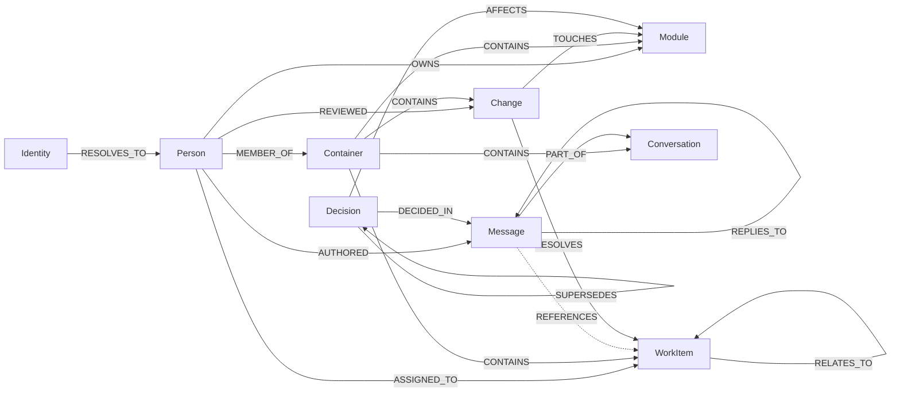

# Graph schema

Jira: EMBER-34. Status: draft for the launch sources (GitHub, GitLab, Jira, Slack, Teams). The engine decision is in [ADR 0002](adr/0002-graph-engine-and-schema-approach.md) (Proposed). The definitions live in code at `services/pipeline/ontology/`; this document explains them, and a test checks that the fixtures map onto them.

## Shape

Nine node types shared by every source, and sixteen relationship types. Source differences are attributes and a registry, not extra node types. A GitHub pull request and a GitLab merge request are both a `Change`; a Slack message and a Teams message are both a `Message`. Queries and agents work across sources without knowing where a thing came from.

Every source-backed node carries `source`, `kind`, `external_id` and `url`. `(group_id, source, external_id)` identifies it.

## Nodes

| Node | Meaning | Attributes beyond the common four |
| --- | --- | --- |
| `Person` | A human, resolved across accounts | `email` |
| `Identity` | One account on one source | `handle` |
| `Container` | Repository, project, channel, team, workspace | none |
| `WorkItem` | Issue, ticket, story, epic | `status`, `item_type` |
| `Change` | Pull request, merge request, commit | `state`, `source_branch`, `target_branch` |
| `Conversation` | Thread or chat | none |
| `Message` | One message, or a comment on a work item or change | none |
| `Decision` | A choice the team made | `status`, `decided_on` |
| `Module` | Directory, package, service, component | `path` |

`Person`, `Decision` and `Module` are not tied to one source, so they have no source fields. A `Person` is created by resolving `Identity` nodes, and `Decision` and `Module` are extracted from text and code paths.

Names, summaries and timestamps come from the graph engine (`name`, `summary`, `created_at`); we do not redefine them.

## Relationships

Each relationship is a fact with validity over time. The allowed endpoints are in `ontology/edges.py` and are the only pairs the extractor may create.

| Relationship | From → To | Meaning |
| --- | --- | --- |
| `RESOLVES_TO` | Identity → Person | This account belongs to this person |
| `AUTHORED` | Person → WorkItem, Change, Message, Decision | Wrote or created it |
| `ASSIGNED_TO` | Person → WorkItem, Change | Is assigned to it |
| `REVIEWED` | Person → Change | Reviewed it (`verdict`) |
| `MEMBER_OF` | Person → Container | Belongs to it |
| `OWNS` | Person → Module | Is responsible for it |
| `CONTAINS` | Container → WorkItem, Change, Conversation, Module | Holds it |
| `PART_OF` | Message → Conversation | Belongs to the thread |
| `REPLIES_TO` | Message → Message | Replies to it |
| `REFERENCES` | Message, WorkItem, Change, Decision → WorkItem, Change, Person, Module, Decision, Container | Mentions or links to it |
| `RESOLVES` | Change → WorkItem | Closes or fixes it |
| `RELATES_TO` | WorkItem → WorkItem | Linked (`link_type`) |
| `TOUCHES` | Change → Module | Modifies it |
| `DECIDED_IN` | Decision → Message, Conversation, Change, WorkItem | Where it was made |
| `SUPERSEDES` | Decision → Decision | Replaces an earlier decision |
| `AFFECTS` | Decision → Module, Container, WorkItem | Constrains it |

Main relationships (the table above is complete; `REFERENCES`, and the extra targets of `AUTHORED`, `ASSIGNED_TO`, `DECIDED_IN` and `AFFECTS`, are left out to keep this readable):

## Launch sources

| Source | Container | WorkItem | Change | Conversation | Message | Identity from |
| --- | --- | --- | --- | --- | --- | --- |
| GitHub | repository | issue | pull_request, commit | | comment | `user.login` |
| GitLab | project | issue | merge_request, commit | | note | `user.username` |
| Jira | project | issue | | | comment | `user.accountId` |
| Slack | channel | | | thread | message | `event.user` |
| Teams | team, channel | | | chat | message | Graph user id |

`ontology/sources.py` holds this table as code, with a `kind_of` function that classifies a raw envelope body. Each fixture in `packages/ingestion-envelope/fixtures/` is checked against it.

Cross-source links come from text and keys: a Jira key such as `EMBER-39` in a Slack message or PR title becomes a `REFERENCES` or `RESOLVES` edge to that `WorkItem`. The key is the join, so it must appear in the item's `external_id` (Jira) or be extracted from the text.

## People

`Identity` nodes are created deterministically from source ids and never merged with each other. `RESOLVES_TO` links an identity to a `Person`. Resolution starts from exact matches (same verified email) and treats anything weaker as a suggestion for review. Because identities stay separate, a wrong merge is one deleted edge, not a graph rewrite.

## Time

Node and edge validity comes from the engine: each fact has `valid_at`, `invalid_at`, `created_at` and `expired_at`. A status change on a `WorkItem` invalidates the old status fact and adds the new one; both stay queryable. `Decision` nodes add `SUPERSEDES` so "what replaced this decision" is a direct edge and not something inferred from invalidation.

## Tenancy

One `group_id` per tenant (for the capstone, one). Sources are attributes, not partitions, so links across sources stay inside the partition.

## Embeddings and config

The engine embeds entity names and fact text. The model and its settings are fixed by [ADR 0001](adr/0001-embedding-model.md). One `(:EmberConfig {key: 'embedding'})` node records the model id, revision, dimension, query template and schema version. `ontology/config.py` checks it at startup and raises on mismatch; the fix for a mismatch is a full rebuild, not editing the node.

## Extending

- New source: add an entry to `SOURCES` (kinds mapped to core types, plus `kind_of`) and fixtures. No graph change.
- New attribute: add an optional field to a model. Existing nodes lack it and stay valid.
- New relationship: add a model and its allowed pairs in `edges.py`.
- New core type: add a model to `entities.py` and edge rows. Do this only when a thing fits none of the nine.
- Removing or renaming a type or attribute is a rebuild. Names must not collide with the engine's reserved fields; `test_ontology.py` checks this.

## Loading into Neo4j

Once the cluster Neo4j is reachable:

1. Let the engine create its indexes (`build_indices_and_constraints()`).
2. Apply `services/pipeline/ontology/schema.cypher`: uniqueness on `(group_id, source, external_id)` per source-backed type, and on `EmberConfig.key`. Neo4j Community supports uniqueness constraints but not existence or node-key constraints, so "required" attributes are enforced in code by the pydantic models. Apply these only after the ADR 0002 spike confirms custom attributes are stored as node properties. The file was checked against Neo4j 5 Community (7 constraints created, re-run is a no-op); it has not been run on the cluster's Neo4j 2026.9.0.
3. Write the `EmberConfig` node from `ontology.config.EXPECTED`.
4. Start ingesting.

Vector indexes are not created; similarity is an exact scan at launch scale. Add one when scale requires it, sized from the recorded dimension.

## Open questions

- Whether one `group_id` per tenant holds up if a deployment needs strict per-source isolation.
- Whether retrieval over entity names and facts alone is enough, or source text needs its own embeddings (spike item 3 in ADR 0002).
- How `Module` gets populated: from paths in PR file lists (deterministic) or extracted from text.
