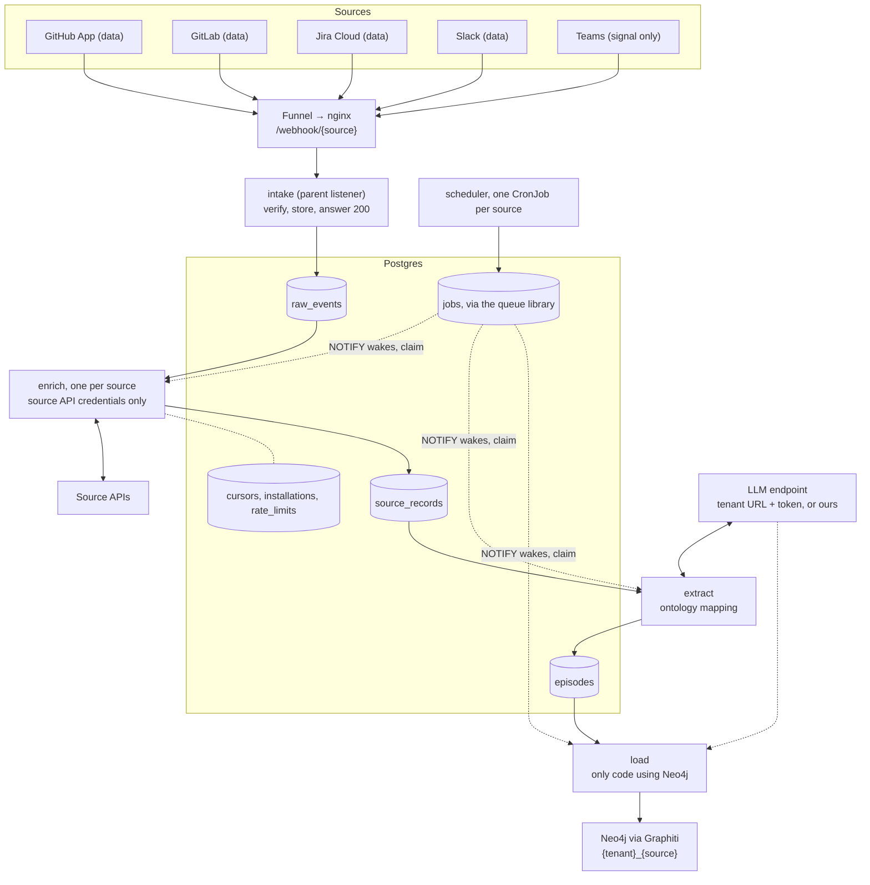

# Ingestion architecture

Jira: EMBER-41. Decision record: [ADR 0004](../adr/0004-ingestion-architecture.md). Editable diagram: [`architecture.excalidraw`](architecture.excalidraw) (open it at [excalidraw.com](https://excalidraw.com) with Open, or the VS Code Excalidraw extension).

Every source posts to one parent listener, **intake**, which verifies the delivery, stores it as it arrived, and answers. Three stages then run in turn, each a separate worker:

1. **enrich** completes the source object, fetching only what the payload lacks.
2. **extract** maps it to graph episodes.
3. **load** writes them to Neo4j.

The stages share nothing but Postgres, so each one can be replayed, scaled or replaced without touching the others.

## EMBER-41 acceptance criteria

| Criterion | Where |
|---|---|
| For each source, the doc states whether the webhook carries data or only signals a change | [Webhooks per source](#webhooks-per-source-data-or-signal) |
| The design covers the parent listener | [The parent listener](#the-parent-listener-intake) |
| The design covers how workers spawn and shut down | [Workers: start, wake and stop](#workers-start-wake-and-stop) |
| The design covers per-source auth | [Per-source auth](#per-source-auth) |
| A diagram is included | [Diagram](#diagram), and `architecture.excalidraw` |

## Diagram



Every arrow into a table is a write that also enqueues the next stage's job in the same transaction.

## Webhooks per source: data or signal

Four of the five sources send the data itself. Teams only signals that something changed. Either way intake stores the delivery as it arrived, and enrich fetches only what is missing.

| Source | Webhook | What the delivery carries | What enrich still fetches | Delivery notes |
|---|---|---|---|---|
| GitHub App | **data** | The whole issue, PR, comment or review as it stood. A push lists up to 20 commits with message, author and changed file paths, without diffs | PR files and diff; commits past the first 20 (compare API); earlier comments in a thread | No automatic retries; payloads over 25 MB are not sent |
| GitLab | **data** | The MR, issue or note with its attributes and what changed. A push carries the newest 20 commits | MR diffs and changes; commits past 20 | Signing token, or the legacy secret token |
| Jira Cloud | **data** | The issue with its fields. `jira:issue_updated` includes that edit's changelog. Comment events carry the comment | Watchers, votes and remote links (no webhook event for them); full changelog pages | Admin webhooks signed with a secret |
| Slack | **data** | The message event with text, user, channel, `ts` and `thread_ts`. `message_changed` also carries the previous text | A thread's parent when only a reply arrived; user profiles | Retried up to 3 times if not answered within 3 s |
| Teams (Graph) | **signal** | A change notification with the resource's IDs, the change type and `clientState`. No message content | The `chatMessage` itself, every time, with an app token | Subscriptions expire: renew within 3 days and handle lifecycle notifications (`docs/ingestion/teams.md`) |

The payload is the record of what happened at that moment, which the temporal graph needs (ADR 0002). Fetching the current state alone would lose intermediate edits and deletes. So payloads are kept, and fetching only adds what they lack.

## The parent listener (intake)

One Deployment (2 replicas) serves every source at `https://ember.tail470a31.ts.net/webhook/{source}`. nginx routes `/webhook/` to Service `intake`. For each delivery intake:

1. answers a handshake, if this is one (Slack `url_verification`, Teams `validationToken`);
2. verifies the signature, token or `clientState`;
3. in one transaction, stores the envelope in `raw_events` and enqueues an `enrich` job;
4. answers 200 after the commit, well inside Slack's and Teams' 3-second limits.

It never calls a source API and holds only webhook secrets.

### HTTP contract

```
POST /webhook/{source}      # source ∈ github | gitlab | jira | slack | teams
GET  /health                # process up; Postgres reachable
```

| Status | When | What the source does |
|---|---|---|
| 200 | Stored and enqueued, or a duplicate of a stored delivery | Done |
| 200 | Handshake: Slack challenge as JSON, Teams `validationToken` as `text/plain` | Marks the endpoint valid |
| 401 | Signature, token or `clientState` check failed | Logs a failed delivery |
| 404 | Unknown `{source}` | Logs a failed delivery |
| 413 | Body over 8 MiB (nginx and intake agree) | Gives up; reconcile picks the object up later |
| 503 | Postgres unreachable, nothing stored | Slack and Jira retry. GitHub does not, so reconcile covers it |

### Source adapters

Everything source-specific about receiving is one adapter per source. Body limits, storage, enqueueing, health and metrics are written once around it. Today's `services/*-ingestion/receiver.py` and `envelope.py` become these adapters.

```python
Source = Literal["github", "gitlab", "jira", "slack", "teams"]   # matches envelope v1 "type"

class SourceAdapter(Protocol):
    name: Source
    def handshake(self, req: Request) -> Response | None: ...   # Slack, Teams; None for a normal delivery
    def verify(self, req: Request) -> None: ...                 # raises Unauthorized
    def delivery_id(self, req: Request) -> str: ...             # stable across the source's retries
    def account_id(self, req: Request) -> str | None: ...       # mapped to a tenant via installations
    def event_name(self, req: Request) -> str: ...
```

| Adapter | `delivery_id` | `account_id` | Handshake |
|---|---|---|---|
| `github` | `X-GitHub-Delivery` | `installation.id` | none |
| `gitlab` | `X-Gitlab-Event-UUID` | `X-Gitlab-Instance` + group | none |
| `jira` | `X-Atlassian-Webhook-Identifier` | Jira site | none |
| `slack` | `event_id` | `team_id` | `url_verification` |
| `teams` | SHA-256 of body | `tenantId` | `validationToken` echo |

A delivery from an account that maps to no tenant is stored with `tenant = null` and not processed. `ember-admin map` assigns the tenant later and enqueues what was stored.

## Stages

Each stage changes for its own reasons: enrich with a source's API, extract with the ontology, load with the graph engine.

| Stage | Reads | Writes | Knows | Never touches |
|---|---|---|---|---|
| **intake** | HTTP deliveries | `raw_events`, an `enrich` job | Each source's signature or secret | Source APIs, ontology, LLM, Neo4j |
| **enrich**, one per source | `raw_events` | `source_records`, an `extract` job | That source's API, rate limits, reconcile cursors | Ontology, LLM, Neo4j |
| **extract**, one service | `source_records` | `episodes`, a `load` job | The ontology (`services/pipeline/ontology`), the LLM when Graphiti is not used | Source APIs, Neo4j |
| **load**, one replica | `episodes` | Neo4j, `episodes.loaded_at` | Graphiti and the Neo4j driver | Sources, their APIs and credentials |

Where the LLM runs depends on ADR 0002's spike:
- **With Graphiti**, `add_episode` calls the LLM itself, so the LLM runs inside load and extract stays a deterministic mapping to episode text.
- **With the fallback** (structured mapping), extract calls the LLM for free text and load writes to Neo4j directly.

The stage boundaries are the same either way. The LLM itself is whatever the tenant points Ember at (a URL and API token), or our own cloud provider on the enterprise instance.

## Lifecycle of one delivery

1. The source posts to `/webhook/{source}`. Funnel and nginx pass it to intake unchanged.
2. The adapter answers a handshake or verifies the delivery.
3. Intake stores the envelope in `raw_events` and enqueues `enrich` in one transaction, then answers 200. A delivery already stored is a no-op.
4. The commit wakes the idle `enrich:<source>` worker. It claims the job, fetches only what the payload lacks, writes a `source_records` row, and enqueues `extract`.
5. `extract` classifies the record with the ontology, writes one or more `episodes`, and enqueues a `load` job for that tenant and source.
6. `load` takes every unloaded episode for that subgraph in `occurred_at` order, writes them, and stamps `loaded_at`. When everything a raw event produced is loaded, it sets `raw_events.completed_at`.
7. A stage that fails retries or dead-letters its own job. Earlier stages are not repeated.
8. On each source's schedule, the scheduler enqueues `reconcile`. Enrich lists what changed since the cursor and stores each object as a `raw_events` row, so missed deliveries go through the same steps from 3 onward.

## Workers: start, wake and stop

Stage workers are always-on Deployments that **pull** jobs. Nothing pushes work into a worker: jobs wait in Postgres, so a stopped or busy worker loses nothing. An idle worker blocks on `LISTEN`, and the commit that enqueues a job wakes it in under a second. A poll every 30 s catches retries that have come due and any notification missed during a reconnect.

| Component | How it starts | How it stops |
|---|---|---|
| intake (parent listener) | Deployment, 2 replicas. Ready once Postgres answers, so nginx never routes to a pod that cannot store | On `SIGTERM` it fails readiness, waits a few seconds while the Service drops it, finishes in-flight requests, then exits. A PodDisruptionBudget keeps one replica up during node drains |
| enrich:&lt;source&gt;, extract, load | Deployment, 1 replica each. The queue library's worker starts, connects and listens | On `SIGTERM` it stops claiming and finishes every job in flight (see [Concurrency](#concurrency)) within `terminationGracePeriodSeconds` (60 s). A job still running when the pod is killed is picked up again once the library sees it stalled |
| scheduler:&lt;source&gt; | CronJob on that source's own schedule, `concurrencyPolicy: Forbid` | Enqueues `reconcile` jobs and exits. `scheduler:teams` also renews Graph subscriptions due within the next day |
| admin CLI | Run by hand, or as a one-off Job | Exits when done |

```python
# every stage worker; the queue library runs this, up to CONCURRENCY jobs at a time
async def run_job(job):
    try:
        await handle(job)                   # output and the next job commit together
    except Throttled as e:
        retry(job, after=e.retry_after, counts=False)
    except Transient:
        retry(job, after=backoff(job.attempts))   # dead after 8 attempts
    except Permanent:
        dead(job)

# claim while fewer than CONCURRENCY jobs are running; LISTEN, NOTIFY, 30 s poll
# SIGTERM: stop claiming, let every running job finish, exit
```

- **Long jobs:** a reconcile that pages through a long history saves its cursor after every page, so a shutdown costs one page.
- **Rollouts:** Flux applies a new image tag and Kubernetes replaces pods one at a time, each stopping as above. A deploy never loses a job.
### Concurrency

A worker runs several jobs at once. The work is nearly all waiting on the network (source APIs, the LLM, Neo4j), so one asyncio process can keep several jobs in flight, and that is much cheaper on two 4 GB nodes than more replicas. The queue library runs it: each Deployment sets `CONCURRENCY` in its environment.

| Stage | Runs at once | Starting `CONCURRENCY` | What limits it |
|---|---|---|---|
| intake | Many requests; it is an HTTP server | n/a | Postgres connections |
| enrich, per source | Jobs across tenants and objects | 4 | The source's rate limits. The shared rate limiter makes extra jobs wait their turn, so raising concurrency never breaks a limit, only queues more |
| extract | One job per record | 4 | What the tenant's or our LLM endpoint handles |
| load | Jobs for different subgraphs | 4, and 1 per subgraph | A lock per `{tenant}_{source}` keeps each subgraph in `occurred_at` order, which Graphiti's fact invalidation needs |

Order only matters at load. Enrich and extract can finish out of order: a `source_records` row is unique per object version, and load sorts episodes by the source's own time, not by when they arrived.

Some jobs also cover many events:

- **load** drains up to 100 unloaded episodes for one subgraph per job, so a burst of 50 Slack messages becomes one or two load jobs.
- **reconcile** pages through many objects in one job.
- **enrich** and **extract** stay one event per job, so one bad payload dead-letters only itself.

Raise `CONCURRENCY` first, then replicas, then add KEDA.

- **Scaling:** replicas are set in the manifests for now. When one replica is too slow, KEDA's PostgreSQL scaler can size each Deployment from queue depth, down to zero, without changing worker code. That is one Flux HelmRelease plus a `ScaledObject` per stage.

## Per-source auth

Each source has two credentials, and they never sit in the same pod. Intake holds the one that **verifies** deliveries, which cannot call any API. That source's enrich worker holds the one that **calls** the API. Per-tenant credentials come from the tenant secret store (EMBER-12); on the homelab they are `*.sops.yaml` Secrets (`infra/docs/flux.md`).

| Source | Inbound: intake verifies | Outbound: enrich calls the API | Scope of the outbound credential |
|---|---|---|---|
| GitHub App | HMAC-SHA256 with the App's webhook secret (`X-Hub-Signature-256`) | App private key → JWT → installation access token, valid 1 hour, refreshed by enrich | Per installation: read Metadata, Contents, Issues, Pull requests |
| GitLab | Signing token (`webhook-signature`), or legacy `X-Gitlab-Token` | Group Access Token with `read_api`, sent as `PRIVATE-TOKEN`, plus the instance URL for self-managed GitLab | Per tenant group |
| Jira Cloud | HMAC-SHA256 with the admin webhook secret (`X-Hub-Signature`) | Basic auth with an Atlassian account email and API token | Per Jira site; what that account can see |
| Slack | Signing secret: HMAC over `v0:timestamp:body`, 5-minute window | Bot token (`xoxb-…`) from the OAuth install, stored by `team_id` | Per workspace; 8 read-only bot scopes; channels the bot is in |
| Teams (Graph) | Per-subscription `clientState`; `validationToken` echo on setup | Entra app ID + secret or certificate → app-only token per tenant (client credentials) | Per Microsoft 365 tenant; `ChannelMessage.Read.Group` |
| LLM | n/a | The tenant's endpoint URL and API token; otherwise our own cloud provider on the enterprise instance | Held by whichever stage calls the LLM |

Each component also connects to Postgres as its own role, limited to the tables it reads and writes, so the stage boundaries are enforced by the database too.

## Storage

Postgres runs on the cluster and holds everything stateful. The envelope keeps the EMBER-39 contract (`{"type", "body"}`); routing metadata sits in columns beside it.

```sql
create table raw_events (
  id           bigint generated always as identity primary key,
  source       text        not null,              -- = envelope.type
  delivery_id  text        not null,              -- adapter delivery_id, or "<object id>@<version>" for reconcile
  account_id   text,
  tenant       text,                              -- null until the account is mapped
  event_name   text        not null,
  origin       text        not null check (origin in ('webhook', 'reconcile', 'backfill')),
  received_at  timestamptz not null default now(),
  completed_at timestamptz,                       -- set when everything it produced is loaded
  envelope     jsonb       not null,
  unique (source, delivery_id)
);

-- retention, daily: done events go 30 days after completion; unfinished ones stay until the source is removed
delete from raw_events where completed_at < now() - interval '30 days';

create table source_records (
  id           bigint generated always as identity primary key,
  source       text not null,
  tenant       text not null,
  kind         text not null,          -- "pull_request", "issue", "message", …
  object_id    text not null,          -- the source's own id: "org/repo#42", "C0123/1696.12"
  version      text not null,          -- updated_at, etag or SHA
  occurred_at  timestamptz not null,   -- the source's time
  record       jsonb not null,         -- payload object + fetched extras
  raw_event_id bigint references raw_events (id) on delete set null,   -- outlives its raw event
  created_at   timestamptz not null default now(),
  unique (source, tenant, object_id, version)
);

create table episodes (
  id                bigint generated always as identity primary key,
  key               text not null unique,     -- "github:pull_request:org/repo#42@<version>"
  tenant            text not null,
  source            text not null,
  kind              text not null,
  occurred_at       timestamptz not null,     -- Graphiti reference_time
  text              text not null,
  attrs             jsonb not null default '{}',
  source_record_id  bigint references source_records (id) on delete cascade,
  extractor_version int not null,
  loaded_at         timestamptz,              -- null = waiting for load
  updated_at        timestamptz not null default now()
);
create index episodes_unloaded on episodes (tenant, source, occurred_at) where loaded_at is null;

create table cursors (
  source text not null, tenant text not null,
  stream text not null,            -- "issues", "pulls", "channel:C0123", "project:42"
  position text not null,          -- timestamp, page token or SHA, as the source pages
  updated_at timestamptz not null default now(),
  primary key (source, tenant, stream)
);

create table installations (
  source text not null, account_id text not null,
  tenant text not null,            -- ontology subgraph_id rules: [a-z0-9][a-z0-9-]*
  added_at timestamptz not null default now(),
  primary key (source, account_id)
);

create table rate_limits (
  source text, tenant text, bucket text,   -- GitHub: installation · Slack: method × workspace · Jira: site
  next_allowed_at timestamptz not null,    -- Graph: app × tenant · GitLab: token
  remaining int,
  primary key (source, tenant, bucket)
);
```

Retention for `raw_events` is 30 days after an event is fully processed. One that has not finished processing stays until its source is removed from the tenant. Replaying enrich therefore reaches back 30 days; anything older comes back through reconcile. Retention for `source_records` and `episodes` is still open.

### Job queue

The queue is a library on the same Postgres, not code we write. Procrastinate is proposed: it is Python, uses only Postgres, and has `LISTEN/NOTIFY` built in. Stages call the protocol below, so the library can be swapped behind it. A job names the row it works on instead of carrying data.

```python
JobKind = Literal["enrich", "reconcile", "extract", "load"]     # one library queue per kind

class JobQueue(Protocol):
    def enqueue(self, job: NewJob, tx: Tx) -> None: ...         # commits with the stage's output
    def jobs(self, kind: JobKind, source: Source | None) -> Iterator[Job]: ...
    def retry(self, job: Job, after: timedelta, counts: bool = True) -> None: ...
    def dead(self, job: Job, error: str) -> None: ...
    def redrive(self, kind: JobKind | None = None, source: Source | None = None) -> int: ...

# job shapes
# {"kind": "enrich",    "source": "github", "tenant": "acme", "ref": 4182}       raw_events.id
# {"kind": "reconcile", "source": "jira",   "tenant": "acme", "stream": "issues"}
# {"kind": "extract",   "source": "github", "tenant": "acme", "ref": 977}        source_records.id
# {"kind": "load",      "source": "github", "tenant": "acme"}                    drain one subgraph
```

| What the design needs | What the library has to provide |
|---|---|
| Workers wake on a new job | `LISTEN/NOTIFY`, with a polling fallback |
| Two workers never take the same job | Row locking (`FOR UPDATE SKIP LOCKED`) |
| One pending `load` or `reconcile` per subgraph, so bursts coalesce | A queueing lock keyed by kind, source and tenant |
| Load applies one subgraph at a time, in order | A lock keyed by tenant and source while a job runs |
| Throttle waits do not use up attempts; transient errors back off | A retry strategy the job can set per error |
| A killed worker's job runs again | Stalled-job detection |
| Output and the next job commit together | Enqueue in the caller's transaction. If the library cannot, an outbox: write the output and a pending row in one transaction, and a relay enqueues it |

## Stage interfaces

```python
class Enricher(Protocol):                     # enrich:<source>
    source: Source
    def enrich(self, ev: RawEvent, api: SourceClient) -> list[NewSourceRecord]: ...
        # GitHub push → compare API past 20 commits; PR → files; Slack reply → parent; Teams → GET message
    def reconcile(self, tenant: str, stream: str, cursor: str | None,
                  api: SourceClient) -> Iterator[tuple[NewRawEvent, str]]: ...
        # (object as an envelope, cursor after it) → raw_events → enrich job

class SourceClient(Protocol):                 # every outbound call goes through one
    def get(self, path: str, bucket: str, **params) -> Json: ...
    def pages(self, path: str, bucket: str, **params) -> Iterator[Json]: ...

class RateLimiter(Protocol):                  # state in rate_limits, shared by replicas
    def acquire(self, source: Source, tenant: str, bucket: str) -> None: ...
    def throttled(self, source: Source, tenant: str, bucket: str, retry_after: float) -> None: ...

class Throttled(Exception):  retry_after: float     # 429, "ratelimited": wait, not counted as an attempt
class Transient(Exception):  ...                    # 5xx, timeout, reset, DNS: 1, 2, 4 … 60 s + jitter, 8 attempts
class Permanent(Exception):  ...                    # invalid_auth, token_revoked, missing_scope: dead at once

class Extractor(Protocol):                    # extract, one per source in one service
    source: Source
    version: int                              # bump to re-extract on replay
    def extract(self, rec: SourceRecord) -> list[Episode]: ...   # kind from ontology SOURCES[source].kind_of

@dataclass(frozen=True)
class Episode:
    key: str
    kind: str
    occurred_at: datetime
    text: str
    attrs: dict

class GraphLoader(Protocol):                  # load: the only code that imports Graphiti or Neo4j
    def load(self, tenant: str, source: Source, episodes: list[Episode]) -> None: ...
        # group_id = subgraph_id(tenant, source); replaces an episode already loaded under the same key
    def delete_tenant(self, tenant: str) -> None: ...   # every tenant_subgraphs(tenant)
```

Today's backfills (`pull_test.py` in each `services/*-ingestion`) become `Enricher.reconcile`. The ontology in `services/pipeline/ontology` is used by extract only.

## Admin and observability

```
ember-admin purge   --tenant acme                       # EMBER-53
ember-admin redrive --kind extract --source github     # dead → ready
ember-admin replay  --stage enrich  --source slack --since 2026-10-01
ember-admin replay  --stage extract --source github    # no API calls
ember-admin replay  --stage load    --tenant acme      # graph engine only
ember-admin map     --source github --account 12345 --tenant acme
```

- `replay --stage` enqueues that stage's jobs over stored rows. Earlier stages are not repeated.
- `purge` marks the tenant as purging so in-flight jobs stop writing. It then deletes the tenant's rows from every table and calls `GraphLoader.delete_tenant`.
- Metrics: `intake_deliveries_total{source,result}`, `jobs{kind,source,state}`, `job_age_seconds{kind}`, `api_throttled_total{source}`, `episodes_unloaded{source}`.

## Failures and replay

| Situation | Handling | Re-runs | Data lost? |
|---|---|---|---|
| Source re-sends a delivery | `unique (source, delivery_id)`: 200, nothing enqueued | Nothing | No |
| Postgres down at intake | 503; Slack and Jira retry, reconcile covers GitHub | Intake | No |
| Source API throttles | Wait `Retry-After` for the whole bucket | That enrich job | No |
| LLM or Graphiti error | Back off and retry the extract or load job | That stage only | No |
| Neo4j down | Load jobs back off; episodes wait unloaded | Load only, no API calls | No |
| Worker killed mid-job | The library sees it stalled; the job runs again | That job | No |
| Extraction bug fixed | Bump `Extractor.version`, `replay --stage extract` | Extract, then load | No |
| Graph engine replaced (ADR 0002 fallback) | New `GraphLoader`, `replay --stage load` | Load only | No |
| Replay older than 30 days | `raw_events` are gone; replay extract or load from stored rows, or reconcile | Reconcile | No |
| Body over 8 MiB | 413; reconcile stores the object later, without that event's snapshot | Reconcile | That event's snapshot |
| Deleted before reconcile ran, webhook missed | Nothing left to fetch | n/a | The delete |

## Deployment

Everything lives in `infra/k8s/apps` and is deployed by Flux (ADR 0003). Images come from GHCR, pulled with the EMBER-56 pull secret.

| Component | Kubernetes object | Image | Secrets it holds |
|---|---|---|---|
| intake | Deployment, 2 replicas, PodDisruptionBudget; nginx routes `/webhook/` to Service `intake` | `ghcr.io/cbu-capstone-design-27/ember/intake` | Webhook secrets, which can verify but not call APIs |
| enrich:&lt;source&gt; | Deployment per source, 1 replica | `…/ember/pipeline`, `enrich --source <source>` | That source's API credentials |
| extract | Deployment, 1 replica | `…/ember/pipeline`, `extract` | The LLM URL and token when extract calls it |
| load | Deployment, 1 replica | `…/ember/pipeline`, `load` | Neo4j password; the LLM URL and token when Graphiti calls it |
| scheduler:&lt;source&gt; | CronJob per source, on its own schedule | `…/ember/pipeline`, `schedule --source <source>` | Database only |
| Postgres | HelmRelease on `local-path-retain`, pinned to one worker like Neo4j | Chart image | Its password; a role per component |
| Neo4j | Existing HelmRelease | Chart image | n/a |

## From today's services

| Today | Becomes |
|---|---|
| `services/{github,gitlab,jira,slack}-ingestion/receiver.py` and `envelope.py` | The adapters inside `services/intake`; Teams is the fifth |
| Each `pull_test.py` backfill | That source's `Enricher.reconcile` |
| Stdout as the hand-off | `raw_events` and the job queue |
| Slack's in-process `RecentEvents` de-duplication | `unique (source, delivery_id)` |
| Per-process rate limiting in the backfills | Shared `rate_limits` |
| Placeholder `github-webhook` behind nginx | Service `intake`, one nginx location for every source |
| `packages/ingestion-envelope` | Unchanged contract; gains the shared verify helpers |

## Decisions

| Question | Decision |
|---|---|
| Which LLM | The tenant supplies a URL and API token. Otherwise our own cloud provider on the enterprise instance |
| Where Postgres runs | On the cluster |
| Queue code | A library on the same Postgres, not hand-written; Procrastinate proposed |
| Raw event retention | 30 days after an event is fully processed; until its source is removed if it is not |
| Accounts with no tenant | Left unmapped for now: stored with `tenant = null`, not processed until mapped |
| Reconcile interval | Set per source, in that source's scheduler CronJob |

### Still open

- Which stage calls the LLM: load through Graphiti, or extract with the fallback. This follows ADR 0002's spike.
- Postgres chart: the CloudNativePG operator, or a single-instance chart.
- The library: confirm Procrastinate can enqueue inside the stage's own transaction, or add the outbox.
- How long `source_records` and `episodes` are kept. They are what extract and load replays read once raw events are gone.
- Each source's reconcile schedule, set from its API limits.
- When to add KEDA.
