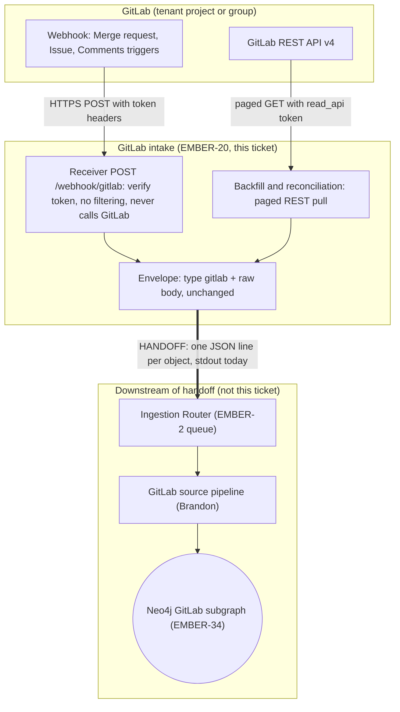

# GitLab ingestion: requirements and architecture

- Jira: EMBER-38 (drop-first), epic EMBER-20 (GitLab Ingestion)
- Status: built in [`services/gitlab-ingestion`](../../services/gitlab-ingestion/README.md) (EMBER-54, rate limits EMBER-55). Not yet run against a live GitLab project.
- GitLab facts were checked against docs.gitlab.com on 2026-09-23; webhook signing and rate limits re-checked on 2026-10-01 (see [Sources](#sources)).
- Related: EMBER-39 intake contract, EMBER-34 graph schema, EMBER-12 auth and multi-tenancy, EMBER-35 GitHub (closest sibling)
- Diagram source for Excalidraw or any Mermaid renderer: [`gitlab/architecture.mmd`](gitlab/architecture.mmd). Word copies: [`gitlab/`](gitlab/).

## Requirements and architecture

This section answers the three EMBER-38 acceptance criteria directly. Each answer links to the section with the details.

### 1. Requirements documented (auth, webhooks/API, data shapes)

- **Auth:** two secrets per tenant. A GitLab access token with `read_api` for backfill, and a webhook signing token (or legacy secret token) to prove deliveries came from GitLab. Details: [Auth](#auth).
- **Webhooks:** one project or group webhook with the **Merge request**, **Issues** and **Comments** triggers. Delivery isn't guaranteed, so a REST backfill is required, not optional. Details: [Webhooks](#webhooks).
- **API:** GitLab REST API v4, paged, for onboarding history and periodic reconciliation. Details: [API access](#api-access-backfill-and-reconciliation).
- **Data shapes:** webhook bodies carry `object_kind`; REST objects don't. Details: [Data shapes](#data-shapes).

### 2. Proposed architecture for GitLab feeding ingestion

Same shape as the GitHub, Jira and Slack workers: a thin receiver that never calls GitLab, a separate backfill that does, and both emitting EMBER-39 intake unchanged. Details: [Architecture](#architecture).

### 3. Handoff points to the ingestion pipeline

One `{"type":"gitlab","body":<raw GitLab JSON>}` line per object. Stdout today, the router's queue (EMBER-2) later. Details: [Handoff to the pipeline](#handoff-to-the-pipeline).

## Auth

1. **API credential:** a GitLab access token with the `read_api` scope, used only by the backfill.
   - Prefer a **Group Access Token** over a Personal Access Token. It belongs to the group, not a person, so it survives someone leaving.
   - Project Access Tokens need Premium or Ultimate on GitLab.com, so the group token is the safer default across tiers.
   - Sent as `PRIVATE-TOKEN: <token>` or `Authorization: Bearer <token>`.
2. **Webhook verification:** set on the webhook itself and checked by the receiver on every delivery.
   - **Signing token (recommended):** HMAC-SHA256, sent in the `webhook-id`, `webhook-timestamp` and `webhook-signature` (`v1,<base64>`) headers.
   - **Secret token (legacy):** a plain string echoed in `X-Gitlab-Token`. Weaker, but common on older and self-hosted instances, so the receiver accepts either.
   - Same local-stub rule as GitHub: if no secret is configured, verification is skipped with a warning.

Both secrets live in the per-tenant secret store (EMBER-12), never in git. The receiver holds only the webhook secret, never the API token.

## Webhooks

GitLab sends one HTTPS POST per event, naming it in the `X-Gitlab-Event` header.

| Trigger | `X-Gitlab-Event` | Fires on | Why Ember wants it |
| --- | --- | --- | --- |
| Merge request events | `Merge Request Hook` | MR opened, updated, approved, merged, closed; new commits on the source branch | The decision unit: what changed and why |
| Issues events | `Issue Hook` / `Work Item Hook` | Issue or work item created, edited, closed, reopened | Ticket-side context |
| Comments | `Note Hook` | Comment on an MR, issue, commit or snippet | MR review comments, where the reasoning lives |

- Scope is set by **which triggers are enabled on the webhook**, not by the receiver. Like the other workers, intake never filters.
- **Confidential issues and confidential comments are separate triggers.** They stay off for the first cut.
- Deferred: push, tag, pipeline, job, wiki, release and milestone triggers.

Delivery rules that shape the design:

- **Not guaranteed-once.** GitLab treats 4xx, 5xx and timeouts as failures. After 4 in a row the webhook is **temporarily disabled** (backing off from 1 minute to 24 hours). After 40 it's **permanently disabled**. The receiver must answer 2xx fast and do no work inline, and the backfill must re-cover any gap.
- **Redacted emails.** A user with no public email shows as `[REDACTED]`, so email can't be the only join key.
- **Commit cap.** Push payloads carry only the newest 20 commits. Only matters if push is added later.

## API access (backfill and reconciliation)

- **Onboarding backfill:** page through merge requests, issues, and each one's notes (`/projects/:id/merge_requests`, `/projects/:id/issues`, `.../:iid/notes`). One envelope per REST object, same as the GitHub `pull_test.py` backfill. Confidential issues and internal notes are skipped, matching the webhook triggers that stay off.
- **Reconciliation:** a scheduled re-pull (`updated_after`) to catch anything a disabled webhook dropped. Cadence depends on EMBER-2 scheduling and the worker architecture (EMBER-41).
- **Rate limits:** see [Rate limits](#rate-limits).

### Rate limits

| Limit | GitLab.com |
| --- | --- |
| Authenticated API traffic, per user | 2,000 requests a minute |
| Unauthenticated API traffic, per IP | 500 requests a minute |
| Webhook calls, per top-level namespace | 500 a minute on Free; more on paid plans |
| Webhook timeout / payload | 10 seconds / 25 MB |

- Self-managed instances set their own numbers. GitLab has proposed lower per-plan hourly limits for GitLab.com, not in effect as of 2026-10-01.
- Every API response carries `RateLimit-Limit`, `RateLimit-Remaining`, `RateLimit-Observed` and `RateLimit-Reset` (a Unix time). A throttled `429` adds `Retry-After` (seconds) and `RateLimit-ResetTime`.
- The backfill pauses every worker when `RateLimit-Remaining` drops to 50 or fewer, honors `Retry-After` on a `429`, and backs off 1s, 2s, 4s on a `429`/`5xx` with no header. Details: [`services/gitlab-ingestion`](../../services/gitlab-ingestion/README.md#rate-limits).

## Data shapes

Every webhook body shares `object_kind`, `event_type`, `user` and `project`. Most carry `object_attributes`; Work Item hooks use expanded top-level fields.

| Object | Fields the pipeline needs | Stable ID |
| --- | --- | --- |
| Merge request | `iid`, `title`, `description`, `state`, `action`, `source_branch`, `target_branch`, `author`, `assignees`, `reviewers`, `labels`, `changes` (updates only) | `project.id` + `iid` |
| Issue / work item | `iid`, `title`, `description`, `state`, `action`, `labels`, `assignees`, `due_date` | `project.id` + `iid` |
| Note (comment) | `note` (the text), `noteable_type`, `noteable_id`, `discussion_id`, `author` | `project.id` + note `id` |

The existing fixture, `packages/ingestion-envelope/fixtures/gitlab.json`, is a Merge Request Hook and already matches this.

## Architecture

| Component | Does | Holds a token? |
| --- | --- | --- |
| Receiver (`services/gitlab-ingestion`, `POST /webhook/gitlab`) | Verifies the signing or secret token, wraps the body, emits one line, answers 2xx | Webhook secret only |
| Backfill / reconciliation (`pull.py`, same image) | Onboarding history and scheduled re-pulls, one envelope per REST object | API token |
| Envelope | `{"type":"gitlab","body":...}` per the EMBER-39 contract. Body unchanged. | No |

Registering the webhook URL and secret on the customer's project or group is onboarding, owned by the CLI and web app (EMBER-11 / EMBER-12). The public HTTPS URL is the same hosting need as the other receivers.

GitLab webhooks carry the full object, not just a change signal, so the receiver never needs to fetch. Only the backfill and reconciliation call the API. This answers the per-source webhook question for the worker architecture (EMBER-41).

## Handoff to the pipeline

| Handoff point | Intake provides | Pipeline is responsible for |
| --- | --- | --- |
| Where data is handed over | One `{type:"gitlab", body}` JSON line per object. Stdout today, the router's queue (EMBER-2) later. | Routing `type: "gitlab"` to the GitLab source pipeline |
| Identifying each object | Webhooks: `object_kind` (`merge_request`, `issue`, `work_item`, `note`). Backfill: raw REST objects, which **have no `object_kind`**. | Classifying both. `services/pipeline/ontology/sources.py` `_gitlab` keys on `object_kind` only, so it misses REST objects and `work_item`. Follow-up for Brandon (EMBER-34). |
| Duplicates | The same MR or comment can arrive from a webhook, a retry and a reconciliation run | Idempotent upsert on the stable IDs in [Data shapes](#data-shapes) |
| Edits and reversals | Every update re-sent in full, with `changes` on MR updates | Superseding, not overwriting, a reversed decision |
| People | `user` / `author` with `username`. Email may be `[REDACTED]`. | Resolving people by `username` first (the key in `docs/graph-schema.md`), email second |
| Noise | Nothing filtered at intake | Filtering and decision detection |

## Sources

Checked on 2026-09-23:

- [Webhook events](https://docs.gitlab.com/user/project/integrations/webhook_events/): event types, headers, payload fields, 20-commit cap, redacted emails
- [Webhooks](https://docs.gitlab.com/user/project/integrations/webhooks/): signing token vs. secret token, auto-disable after 4 and 40 failures
- [REST API authentication](https://docs.gitlab.com/api/rest/authentication/): token headers, OAuth 2-hour expiry
- [Token overview](https://docs.gitlab.com/security/tokens/): personal vs. project vs. group access tokens

Checked on 2026-10-01:

- [Webhooks](https://docs.gitlab.com/user/project/integrations/webhooks/): signing token format (`whsec_`, base64 key), signed string, `v1,` signatures, `webhook-id` / `Idempotency-Key` stable across retries
- [GitLab.com settings](https://docs.gitlab.com/user/gitlab_com/): webhook timeout, payload size and rate limits
- [GitLab.com rate limits](https://docs.gitlab.com/user/gitlab_com/rate_limits/): authenticated and unauthenticated API limits, proposed per-plan limits
- [User and IP rate limits](https://docs.gitlab.com/administration/settings/user_and_ip_rate_limits/): `RateLimit-*` and `Retry-After` response headers
