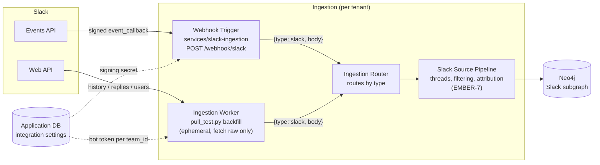

# Slack ingestion: requirements and architecture

- Jira: EMBER-36 (floor), epic EMBER-7 (Slack Ingestion)
- Status: proposed, for team review. Intake worker built: `services/slack-ingestion`.
- Verified live against the Ember workspace (2026-09-29):
  - Receiver, reached through a temporary tunnel: Slack's Request URL check passed with signing on. Slack delivered a message, a thread reply, a `message_changed` edit, a reaction, and six `channel_join` events. Each one was signature-checked and each envelope validated.
  - Backfill: it read the workspace, its members, and the history of the channels the bot had been invited to. Channels the bot wasn't in were skipped.
- Related: EMBER-39 intake contract, EMBER-3/34 graph schema, EMBER-12 auth and multi-tenancy, EMBER-37 Teams, EMBER-53 agent removal and data retention

## Requirements and architecture

This section answers the three EMBER-36 acceptance criteria directly. Each answer links to the section with the details.

### 1. Requirements documented (auth, events, data shapes, rate limits)

- **Auth:**
  - One Slack app per deployment, created from `services/slack-ingestion/slack-app-manifest.json`.
  - Each workspace installs the app and gets a **bot token** (`xoxb-…`). The app has one **signing secret**, which checks that every live request came from Slack.
  - The bot has 8 read-only scopes:
    - `channels:history` and `groups:history`
    - `channels:read` and `groups:read`
    - `users:read` and `users:read.email`
    - `team:read`
    - `reactions:read`
  - It reads only channels it has been invited to. There are no DM scopes and no user tokens.
  - For more than one workspace, the CLI / web onboarding (EMBER-12) runs Slack's OAuth install and stores the bot token by `team_id`. The intake worker never runs OAuth.
  - Details: [Auth](#auth).
- **Events:** the app subscribes to 18 bot events:
  - new messages, which also carry edits, deletes and thread replies as subtypes: `message.channels` and `message.groups`
  - reactions
  - public and private channel lifecycle
  - channel membership
  - user changes
  - uninstall and token revocation

  DMs, files and pins are left out on purpose. Details: [Events](#events).
- **Data shapes:**
  - Every line is `{"type":"slack","body":<raw Slack object>}` (EMBER-39).
  - `body` is one of:
    - a live Events API request (`event_callback`, key `team_id` + `event_id`)
    - an `app_rate_limited` notice
    - a backfilled workspace, member, or channel object (key `id`)
    - a backfilled message or reply (key `channel` + `ts`)
  - Bodies are unmodified, except that backfilled messages get the `channel` they were read from.
  - Details: [Data shapes](#data-shapes).
- **Rate limits:**
  - **Inbound (Events API):**
    - Slack must get an answer within 3 seconds. Otherwise it retries up to 3 times.
    - Slack delivers about 30,000 events per workspace per hour. Past that it sends `app_rate_limited` and drops events.
  - **Outbound (Web API, backfill):**
    - Limits are per method: history and replies are Tier 3 (50+/min), and list methods are Tier 2 (20+/min).
    - A `429` carries `Retry-After`, and the backfill waits it out per method.
  - **Risk for hosted Ember:** Slack's 2025 limit on history for non-Marketplace apps. Verify it before hosted launch.
  - Details: [Rate limits](#rate-limits).

### 2. Proposed architecture for how Slack feeds ingestion

Slack feeds the per-tenant ingestion pipeline from the team architecture diagram (section 2) along two paths. Both emit the same `{type, body}` intake.

```
Slack Events API ──signed POST──▶ Webhook Trigger: services/slack-ingestion receiver.py
                                   (verify signature, answer challenge, wrap, de-dupe retries)
                                              │
Slack Web API ◀──bot token── Ingestion Worker: pull_test.py backfill
                              (onboarding, gaps, newly joined channels)
                                              │
                                              ▼
                              {"type":"slack","body":<raw>}
                                              │
                                              ▼
                     Ingestion Router ──▶ Slack Source Pipeline (EMBER-7) ──▶ Neo4j Slack subgraph
```

- **Live path:**
  - Slack POSTs each event to `https://<ember-host>/webhook/slack`.
  - The receiver verifies it, acknowledges within 3 s, and emits it.
  - The receiver holds no token and works for any workspace.
- **Pull path:** the backfill uses the workspace's bot token to read the members and the channels the bot is in. It runs:
  - at onboarding
  - after an `app_rate_limited` gap
  - when the bot is invited to a new channel
- **Deployment:**
  - One small stdlib Python container: the `slack-ingestion` compose profile, port 8082.
  - It needs a permanent public HTTPS URL. That URL is not set up yet; it will be shared with the GitHub and Jira receivers.
- Details: [Architecture](#architecture).

### 3. Clear handoff points to the ingestion pipeline

| Handoff point | Intake (this worker) provides | Pipeline (EMBER-7) is responsible for |
| --- | --- | --- |
| **Where data is handed over** | One `{type, body}` JSON line per object. Today it goes to stdout; later it goes to the router's job queue (EMBER-2). | Reading from the queue and routing `type: "slack"` to the Slack source pipeline |
| **Identifying each object** | Stable ids: `team_id` + `event_id` (live), `channel` + `ts` (messages), `id` (workspace, members, channels). The shapes are listed in [Data shapes](#data-shapes). | Recognizing each shape, and treating live and backfilled copies of one message as the same message |
| **Duplicates** | Each retried event is emitted once per receiver run | Idempotent upserts on the keys above, which also survive a receiver restart |
| **Threads** | `thread_ts` on every reply. The backfill emits each reply right after its parent. | Rebuilding each thread as one record |
| **Edits and deletes** | `message_changed` (old and new text) and `message_deleted` (`deleted_ts`) | Applying them to the stored message. A reversed decision supersedes the old one; it does not overwrite it. |
| **People** | Raw member objects with email, plus `user_change` events | Resolving `U…` ids to people and joining them to GitHub and Jira by email |
| **Noise and decisions** | Nothing filtered: joins, bot posts and emoji replies all arrive | Filtering, decision detection, and attribution |
| **Gaps and scope changes** | `app_rate_limited` notices, and the bot's own `member_joined_channel` / `member_left_channel` events | Triggering a backfill. Starting or stopping a channel. Stored data is kept on channel removal and purged on dashboard disconnect ([EMBER-53](#agent-removal-and-data-retention-ember-53)). |

Details: [Handoff to the pipeline](#handoff-to-the-pipeline).

## Why Slack matters to Ember

Slack is where a team argues its way to a decision: "why Neo4j?", "we're dropping X", "ship Friday". The proposal's example answer ("your manager chose DI in a Teams meeting…") only works if chat is captured. Most messages carry no durable context, so the hard part is **filtering** (finding threads where a decision is made, attributing statements to people, collapsing a thread into one record). That lives downstream in the Slack source pipeline. This document covers everything before it: how raw Slack data reaches the pipeline, complete and unmodified.

## Requirements

### Functional

| # | Requirement | How the first cut meets it |
| --- | --- | --- |
| F1 | Capture new messages, edits, deletes, and thread replies in near real time | Events API `message.channels`/`message.groups`. Edits and deletes are `message_changed`/`message_deleted` subtypes. Replies carry `thread_ts`. |
| F2 | Capture history that predates the install | `pull_test.py` backfill: `conversations.history` + `conversations.replies` |
| F3 | Know who said what, joined to the same person in GitHub and Jira | `users.list` with `users:read.email`. `user_change` and `team_join` events keep it current. |
| F4 | Know the channel context (name, topic, purpose, private or public) and its changes | Channel objects from `conversations.list`. `channel_*` and `group_*` events. |
| F5 | Capture lightweight agreement signals | `reaction_added`/`reaction_removed` (a ✅ on a proposal is often the decision) |
| F6 | Work for any workspace with no code change | Workspace-agnostic receiver keyed by `team_id`. Tokens behind one `bot_token()` seam. The app is created from a committed manifest. |
| F7 | Emit the shared intake shape | `{"type":"slack","body":<raw>}` per EMBER-39 |
| F8 | Notice uninstall and revoked tokens | `app_uninstalled`, `tokens_revoked` events pass through as intake |

### Non-functional

| # | Requirement |
| --- | --- |
| N1 | **Privacy:** only channels the bot is invited to. No DMs or group DMs. No `channels:join`, so Ember never adds itself to a channel. |
| N2 | **Authenticity:** every live request is signature-checked with a five-minute replay window. |
| N3 | **Secrets:** tokens and the signing secret come from env or integration settings only, and never appear in URLs, logs, or git. |
| N4 | **Availability:** acknowledge within Slack's three-second limit and never block on downstream work. |
| N5 | **Idempotency:** Slack retries, and backfill overlaps live events. Everything downstream keys on stable ids (below). |
| N6 | **Self-host friendly:** stdlib Python, one small container, no data leaves the team's network except to Slack. |

## Auth

**Model: one Slack app, a bot token per workspace, a signing secret per app.**

| Credential | Looks like | Used by | Where it lives |
| --- | --- | --- | --- |
| Signing secret | 32 hex chars | receiver: verifies every request | `SLACK_SIGNING_SECRET` → later the deployment's secret store |
| Bot token | `xoxb-…` | backfill and any later Web API fetch | `SLACK_BOT_TOKEN` → later Application Database integration settings, keyed by `team_id` |
| App-level token | `xapp-…` | Socket Mode only | not used |
| User token | `xoxp-…` | per-person access (DMs, search) | not used, and refused by `bot_token()` |

**Bot scopes** (`slack-app-manifest.json`, mirrored in `receiver.REQUIRED_BOT_SCOPES`):

| Scope | Why |
| --- | --- |
| `channels:history`, `groups:history` | Read messages in public and private channels the bot is in, and receive `message.*` events |
| `channels:read`, `groups:read` | List channels and membership. Receive channel lifecycle events. |
| `users:read` | Resolve `U…` ids to people |
| `users:read.email` | Email is the join key to GitHub and Jira identities. Optional if a team objects; attribution then falls back to names. |
| `team:read` | Workspace name and domain for the tenant record |
| `reactions:read` | Reaction events |

**Why a bot token and not user tokens** (the Salesforce Slackbot used user tokens with `search.messages`): a bot sees exactly the channels a team deliberately invites it to, keeps working when the installer leaves the company, and never exposes anyone's DMs. User tokens would read everything one person can see, and the data would vanish with that person.

**Install and multi-workspace.** The proposal puts source OAuth in the CLI and web onboarding (Elijah, EMBER-12), stored as integration settings in the Application Database. The intake worker never runs an OAuth flow. For a hosted multi-workspace deployment, the onboarding app runs Slack's OAuth v2 install (`oauth.v2.access`) and stores `{team_id, bot_token, bot_user_id, scopes}`. `bot_token()` then reads that record instead of the env var. Slack app creation for self-hosting is "create from manifest", which is one paste.

**Rotation and revocation.** Token rotation is off in the manifest (bot tokens do not expire). A `tokens_revoked` or `app_uninstalled` event reaches the pipeline as intake. The integration-settings owner should mark that workspace disconnected and stop backfills.

## Events

Subscribed bot events (`slack-app-manifest.json`, mirrored in `receiver.RECOMMENDED_BOT_EVENTS`):

| Group | Events | Notes |
| --- | --- | --- |
| Messages | `message.channels`, `message.groups` | New messages, thread replies (`thread_ts`), edits (`message_changed`), deletes (`message_deleted`), broadcasts (`thread_broadcast`), joins and topic changes as subtypes |
| Reactions | `reaction_added`, `reaction_removed` | `item.channel` + `item.ts` point at the message |
| Channels | `channel_created`, `channel_rename`, `channel_archive`, `channel_unarchive`, `channel_deleted` | Public channel lifecycle |
| Private channels | `group_rename`, `group_archive`, `group_unarchive` | Private channel lifecycle for channels the bot is in |
| Membership | `member_joined_channel`, `member_left_channel` | Includes the bot itself being invited or removed, which means scope changed |
| People | `user_change`, `team_join` | Keeps identity and email current |
| Lifecycle | `app_uninstalled`, `tokens_revoked` | Disconnect signals |

Not subscribed: `message.im`, `message.mpim` (DMs), `file_*` (metadata already arrives inside messages), `pin_*` and `star_*` (would need more scopes; revisit if pins prove to mark decisions).

## Data shapes

Every intake line is `{"type":"slack","body":<object>}`. `body` is one of these raw Slack shapes. The pipeline tells them apart by shape, as the Jira pipeline does.

| Source | `body` is | Identify by | Stable id |
| --- | --- | --- | --- |
| Live event | The full Events API request: `{type:"event_callback", team_id, api_app_id, event_id, event_time, authorizations, event:{…}}` | `body.type == "event_callback"` | `team_id` + `event_id` |
| Live, throttled | `{type:"app_rate_limited", team_id, minute_rate_limited}` | `body.type == "app_rate_limited"` | Signals a gap. Backfill that window. |
| Backfill | Workspace from `team.info` | has `domain`, `id` `T…` | `id` |
| Backfill | Member from `users.list` | has `profile` and `is_bot` | `id` (`U…`/`W…`) |
| Backfill | Channel from `conversations.list` | has `is_member` / `is_channel` | `id` (`C…`/`G…`) |
| Backfill | Message or reply | `type == "message"` and `ts` | `channel` + `ts` |

Message essentials the pipeline relies on: `ts` (string, unique per channel, also the timestamp), `thread_ts` (equals `ts` on a thread parent, points at the parent on a reply), `user` or `bot_id`, `text`, `blocks` (rich text), `subtype`, `reply_count`, `reactions`, `files` (metadata), `edited`.

**The one annotation:** a message returned by `conversations.history` or `conversations.replies` has no channel id. The backfill sets `channel` (the field name Slack uses on message events) when absent. Otherwise backfill bodies are byte-for-byte what Slack returned.

**Tenant:** a live body carries `team_id`. A backfill run covers one workspace and its first line is that workspace's `team.info` object. The per-tenant pipeline (architecture diagram, section 2) knows which tenant it is running for.

## Rate limits

**Events API (inbound):**

- Answer within **3 seconds** or Slack retries up to 3 times (roughly immediately, after 1 minute, after 5 minutes), with `X-Slack-Retry-Num` and `X-Slack-Retry-Reason`. If most deliveries keep failing, Slack temporarily disables the app's event subscriptions. The receiver acknowledges before doing anything else.
- Delivery is capped at about **30,000 events per workspace per app per hour**. Past that, Slack sends `app_rate_limited` and drops events. The receiver emits that notice so the pipeline can schedule a backfill of the gap.

**Web API (outbound, backfill):** limits are per method, per workspace, per app, by tier:

| Method | Tier | Rough limit |
| --- | --- | --- |
| `conversations.history`, `conversations.replies` | 3 | 50+ per minute |
| `conversations.list`, `users.list` | 2 | 20+ per minute |
| `team.info` | 3 | 50+ per minute |

A `429` carries `Retry-After`. The backfill gives each method its own gate, so a throttled `conversations.replies` does not stall `users.list`.

**Distribution caveat (verify against current Slack docs before hosted launch):** in 2025 Slack cut `conversations.history` and `conversations.replies` to about 1 request per minute and 15 messages per page for **commercially distributed apps not listed in the Slack Marketplace**. Apps a workspace builds for itself ("internal", including one created from our manifest by a self-hosting team) keep the normal tiers. Consequences:

- Self-hosted Ember: unaffected. Each team creates its own internal app.
- Hosted Ember installed into other companies' workspaces: backfill would be throttled to near-uselessness unless the app is Marketplace-approved. Live events are not affected. Plan the Marketplace review as part of hosted launch, or keep hosted backfill shallow.

## Architecture

Matches the team architecture diagram (section 2, "ingestion pipeline per tenant").



- **Live path:** Slack → receiver (verify, answer challenge, wrap) → stdout today, the router's queue later. The receiver never calls Slack.
- **Pull path:** the backfill worker fetches raw objects with the workspace's bot token. It runs at onboarding, after `app_rate_limited` gaps, and when the bot is invited to a new channel (`member_joined_channel` where `user` is the bot → backfill that one channel with `--channel`).
- **Public URL:** Slack must reach `/webhook/slack` over HTTPS on port 443. Hosted: the cluster ingress. Self-hosted: any reverse proxy or tunnel. Socket Mode would avoid a public URL but needs a websocket dependency and doesn't match the other workers. It's recorded as a future option for teams that cannot expose a URL.

## Handoff to the pipeline

What the Slack source pipeline (EMBER-7, Brandon's processing layer) can rely on, and what it owns:

| Concern | Intake guarantees | Pipeline does |
| --- | --- | --- |
| De-duplication | Stable ids on every object. A retry of an emitted event is suppressed per process. | Idempotent upsert on `team_id` + `event_id` (live) and `channel` + `ts` (messages). A backfilled message and its live event share `channel` + `ts`. |
| Threads | `thread_ts` on replies. Backfill emits each reply right after its parent. | Group by `channel` + `thread_ts`. Rebuild each thread as one record. |
| Edits and deletes | `message_changed` (old and new text), `message_deleted` (`deleted_ts`) | Apply to the stored message by `channel` + `ts`. Keep history so a reversed decision **supersedes** instead of overwriting (proposal requirement). |
| People | Raw user objects with email, and `user_change` | Resolve `U…` → Person node. Join to GitHub and Jira by email. |
| Noise | Nothing is filtered at intake: joins, bot posts, and emoji-only replies all arrive | Filtering and decision detection (research result, negative results included, per EMBER-7) |
| Gaps | `app_rate_limited` notices | Trigger a backfill with `--since` |
| Scope changes | `member_joined_channel`/`member_left_channel` for the bot | Start or stop reading that channel. Already-ingested data is kept; a dashboard disconnect purges it ([EMBER-53](#agent-removal-and-data-retention-ember-53)). |

## Privacy and security

- Scope is opt-in per channel through invites. The bot cannot read channels it is not in or any DM.
- Signature verification plus a five-minute timestamp window. Unsigned requests are refused when a secret is configured.
- The token is sent only in the `Authorization` header. It never appears in a URL, a log line, or an error message.
- Self-hosted: all Slack data stays on the team's hardware.

Lessons carried over from the Salesforce Slackbot (NavalX): it stored user tokens in a plain custom field, skipped its OAuth CSRF check when a cache partition was missing, and logged full Slack responses and nonces at INFO. Here tokens live only in env or integration settings, signature checks never silently degrade when a secret is set, and bodies go only to the intake stream, never to logs.

## Agent removal and data retention (EMBER-53)

What happens to ingested Slack data when Ember's bot (the "agent") is removed. This section records the team's decision and looks ahead at how each option plays out in the knowledge graph (ADR 0002, `docs/graph-schema.md`).

### Decision

| Action | Who does it | Ingestion | Data already in Ember |
| --- | --- | --- | --- |
| **Remove the bot from a channel** (`/remove @Ember`, or kicking it) | Anyone with channel rights, in Slack | **Stops** for that channel | **Kept** |
| **Disconnect Slack from the Ember dashboard** | A workspace admin, in Ember | **Stops** for the whole workspace | **Purged** |

**Why it's split this way:**
- Leaving a channel is easy to do by accident and often temporary, and the decisions already captured are the institutional memory Ember exists to keep.
- Disconnecting is a deliberate admin action in Ember itself, and it signals "we don't want Ember to have our data". So it removes everything.

### What each action does

**Remove the bot from a channel: keep**
1. Slack sends `member_left_channel` (or `channel_left`) with the bot as the user, through the subscriptions Ember already has. The intake worker passes it on like any event.
2. The pipeline marks that channel **inactive** in the integration settings (Application Database) and records `left_at`. Live events stop arriving on their own, because Slack only sends events for channels the bot is in. Backfill and resync skip inactive channels.
3. **The graph is not touched.** Messages, threads, decisions and people from that channel stay, and their facts stay valid, because they were true when they were said.
4. Retrieval should show that the channel's facts are as of `left_at`. A decision recorded there may have been revisited later, out of Ember's view.
5. If the bot is invited back, `member_joined_channel` reactivates the channel, and a backfill with `--since <left_at>` fills the gap.

**Disconnect from the dashboard: purge** (sequence matters, or purged data can come back)
1. **Stop new data first:**
   - Mark the workspace `disconnecting` in the integration settings.
   - Uninstall the app with `apps.uninstall`, or revoke the token with `auth.revoke`. That stops events and kills the token.
   - Reject anything for that `team_id` still in the queue. The router checks the flag, so in-flight jobs can't write after the purge.
2. **Delete the subgraph:** Graphiti `clear_data(driver, group_ids=["<tenant>_slack"])` runs `DETACH DELETE` on every entity, episode and community node in that `group_id`, with their relationships.
3. **Delete every other copy:**
   - raw intake (`{type:"slack"}` JSONL, and the "data lake" from the proposal)
   - queued jobs
   - the token and integration settings
4. **Keep an audit record:** who disconnected, when, and how many nodes were removed, with **no content**.
5. Mark the workspace `disconnected`. Reconnecting later is a fresh install and a full backfill.

### Does purging hurt the database?

**Purging a whole Slack connection: no.** This is the payoff of the per-source subgraph design (`group_id = <tenant>_slack`):
- Everything from that Slack workspace is in one subgraph, and `clear_data` removes exactly that subgraph. The GitHub, Jira, GitLab and Teams subgraphs, the `EmberConfig` node, and the schema constraints are untouched.
- The uniqueness keys `(group_id, source, external_id)` become free again, so a later reconnect and backfill works normally.
- **Phase 2 caveat:** cross-source links (a Slack `Identity` → a shared `Person`, or a Slack message `REFERENCES` a Jira issue) are relationships, and `DETACH DELETE` removes them too. The other sources keep their own nodes; they just lose the Slack-side links. No dangling references are possible in Neo4j.
- **Scale:** a large workspace should be deleted in batches (`CALL { … } IN TRANSACTIONS`) so one huge transaction doesn't stall the database. That's a performance concern, not a correctness one.

**Purging one channel while keeping the rest: yes, it can, unless the graph is built for it.** This isn't in the decision above, but it's the obvious next ask ("remove *that* channel's data"). Graphiti's built-in `remove_episode()` (checked against its source) gets this wrong in three ways:

| Problem | What happens | Why it matters |
| --- | --- | --- |
| **Over-deletion** | It deletes every fact whose **first** source was the purged message, even if messages in other channels later confirmed the same fact | Valid knowledge from channels you kept disappears |
| **Leaked content** | Shared nodes (a `Person`, a `Decision`, a `Module`) survive if anything else mentions them, but their engine-written **summary** isn't rewritten | Sentences from the purged channel can live on inside a summary. That's a privacy failure. |
| **Broken history** | A `Decision` made in the purged channel can be `SUPERSEDED` by one in a kept channel, or the reverse. Its `DECIDED_IN` evidence disappears. | "Why did we decide X?" chains get gaps, and retrieval may cite a decision whose source is gone |

Neo4j itself stays consistent in every case: no corruption, no dangling edges. The damage is to **meaning**: lost knowledge, leaked text, broken history.

### Future: making per-channel purge safe (note for Brandon)

The ticket asks for a **source channel attribute** on nodes. That's necessary, but on its own it's not sufficient, because some nodes belong to more than one channel.

| Node type | Belongs to one channel? | What to store |
| --- | --- | --- |
| `Container` (the channel), `Conversation` (thread), `Message` | Yes | A `channel` attribute: the Slack channel ID (`C…`/`G…`). It's already on every intake message, and the backfill sets it. Purge deletes these by channel directly. |
| `Identity`, `Person`, `Decision`, `Module` | **No.** The same person or decision shows up across channels. | **Provenance through episodes**, not one attribute. Every Graphiti episode (one intake envelope) is tagged with its channel, e.g. in the episode `name` or `source_description`. A node or fact belongs to a channel only through the episodes that mention it. |

**Purge algorithm** (our own code, replacing `remove_episode`):
1. Collect the episodes tagged with the channel.
2. Delete `Message`, `Conversation` and `Container` nodes with that `channel`.
3. For each fact edge, remove the purged episode IDs from its `episodes` list. Delete the edge only when **no** supporting episode remains.
4. Delete entity nodes that no remaining episode mentions.
5. **Regenerate the summary** of every surviving entity that a purged episode mentioned, from its remaining episodes only. Rebuild communities if they're used.
6. Mark decisions that lost all their `DECIDED_IN` evidence as `evidence removed`, instead of silently keeping them.

**Alternative:** one subgraph per channel (`<tenant>_slack_<channel>`). Channel purge would then be a clean `clear_data`, like disconnect. The cost: Graphiti deduplicates within a `group_id` only, so the same person or decision would be split into one node per channel, and every query would span many subgraphs. **Not recommended** unless per-channel purge becomes a hard requirement.

### Future options beyond the decision

| Option | What it is | When it's worth it |
| --- | --- | --- |
| **Grace period** | Disconnect hides the subgraph from retrieval **immediately** (a `disconnected` flag checked at query time), then hard-deletes after e.g. 30 days, unless the admin reconnects | Protects against accidental disconnects. There's still one hard-delete path at the end. |
| **Redact, keep decisions** | Delete messages and identities, but keep `Decision` nodes and their `SUPERSEDES` chain, with the evidence marked as removed | Teams that want privacy and institutional memory. Needs the admin's explicit choice at disconnect. |
| **Per-channel purge from the dashboard** | The algorithm above | When users ask to remove one channel's data without disconnecting |

### What a purge cannot reach

These need to be stated in the product and the docs, not discovered later:
- **Answers already given:** agents (Claude Code, Codex, Cursor) may have received Ember answers built on the purged data. Those can't be recalled.
- **Hosted LLM calls:** with "your API key" mode (architecture diagram, Extraction LLM), extraction prompts went to the model provider under their retention terms. The local model on the Spark avoids this.
- **Backups:** Neo4j snapshots and volume backups (EMBER-30/32) keep purged data until they age out. The backup retention period is effectively the real purge deadline. Jacob should set and document it.

### Same pattern for other sources

| Source | "Remove the agent from one scope": keep | "Disconnect": purge `<tenant>_<source>` |
| --- | --- | --- |
| Slack | Bot removed from a channel (`member_left_channel`) | Dashboard disconnect, `apps.uninstall` |
| Teams | Ember app removed from a team (RSC grant revoked; subscriptions fail) | Dashboard disconnect |
| GitHub | Repo deselected in the App installation (`installation_repositories` removed) | App uninstalled (`installation` deleted) or dashboard disconnect |
| GitLab, Jira | Project removed from the webhook or connection | Dashboard disconnect |

One rule for every source keeps the dashboard's behavior predictable.

## Shared patterns for Teams (EMBER-37)

Teams can reuse this shape almost one-for-one:

| Slack | Teams (Microsoft Graph) |
| --- | --- |
| `POST /webhook/slack`, signing secret | `POST /webhook/teams`, change-notification `clientState` plus validation token |
| `url_verification` challenge | `validationToken` query parameter echo on subscription create |
| Bot token per `team_id` | App-only Graph token per tenant (`tenantId`) |
| Channels the bot is invited to | Teams and channels the app is installed in (resource-specific consent) |
| `conversations.history`/`replies` backfill | `/teams/{id}/channels/{id}/messages` and `/replies` |
| Events keep flowing | Graph subscriptions **expire** (about an hour for chat messages) and must be renewed. That's the main new moving part, and the auth risk EMBER-19 flags. |

## Open questions

1. ~~When the bot is removed from a channel, keep what was already ingested or purge it?~~ **Answered (EMBER-53):** removing the bot from a channel keeps the data; disconnecting from the dashboard purges it. See [Agent removal and data retention](#agent-removal-and-data-retention-ember-53).
2. Is `users:read.email` acceptable to every team, or should email join be opt-in?
3. Hosted launch: pursue Slack Marketplace listing (backfill limits) or ship hosted with live-only plus shallow backfill?
4. Should the pipeline treat `thread_broadcast` replies as channel-level statements or only as thread members?
