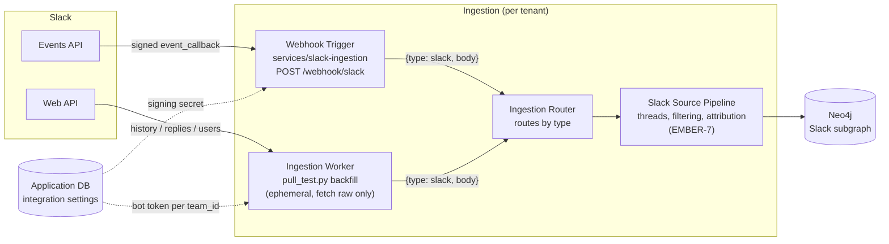

# Slack ingestion: requirements and architecture

- Jira: EMBER-36 (floor), epic EMBER-7 (Slack Ingestion)
- Status: requirements and architecture accepted for the first cut. Intake worker built: `services/slack-ingestion`.
- Verified live against the Ember workspace (2026-09-29):
  - Receiver, reached through a temporary tunnel: Slack's Request URL check passed with signing on. Slack delivered a message, a thread reply, a `message_changed` edit, a reaction, and six `channel_join` events. Each one was signature-checked and each envelope validated.
  - Backfill: it read the workspace, its members, and the history of the channels the bot had been invited to. Channels the bot wasn't in were skipped.
- Related: EMBER-39 intake contract, EMBER-3/34 graph schema, EMBER-12 auth and multi-tenancy, EMBER-37 Teams

## Why Slack matters to Ember

Slack is where a team argues its way to a decision: "why Neo4j?", "we're dropping X", "ship Friday". The proposal's example answer ("your manager chose DI in a Teams meeting…") only works if chat is captured. Most messages carry no durable context, so the hard part is **filtering** (finding threads where a decision is made, attributing statements to people, collapsing a thread into one record). That lives downstream in the Slack source pipeline. This document covers everything before it: how raw Slack data reaches the pipeline, complete and unmodified.

## Requirements

### Functional

| # | Requirement | How the first cut meets it |
| --- | --- | --- |
| F1 | Capture new messages, edits, deletes, and thread replies in near real time | Events API `message.channels`/`message.groups`. Edits and deletes are `message_changed`/`message_deleted` subtypes. Replies carry `thread_ts`. |
| F2 | Capture history that predates the install | `pull_test.py` backfill: `conversations.history` + `conversations.replies` |
| F3 | Know who said what, joined to the same person in GitHub and Jira | `users.list` with `users:read.email`. `user_change` and `team_join` events keep it current. |
| F4 | Know the channel context (name, topic, purpose, private or public) and its changes | Channel objects from `conversations.list`. `channel_*` and `group_*` events. |
| F5 | Capture lightweight agreement signals | `reaction_added`/`reaction_removed` (a ✅ on a proposal is often the decision) |
| F6 | Work for any workspace with no code change | Workspace-agnostic receiver keyed by `team_id`. Tokens behind one `bot_token()` seam. The app is created from a committed manifest. |
| F7 | Emit the shared intake shape | `{"type":"slack","body":<raw>}` per EMBER-39 |
| F8 | Notice uninstall and revoked tokens | `app_uninstalled`, `tokens_revoked` events pass through as intake |

### Non-functional

| # | Requirement |
| --- | --- |
| N1 | **Privacy:** only channels the bot is invited to. No DMs or group DMs. No `channels:join`, so Ember never adds itself to a channel. |
| N2 | **Authenticity:** every live request is signature-checked with a five-minute replay window. |
| N3 | **Secrets:** tokens and the signing secret come from env or integration settings only, and never appear in URLs, logs, or git. |
| N4 | **Availability:** acknowledge within Slack's three-second limit and never block on downstream work. |
| N5 | **Idempotency:** Slack retries, and backfill overlaps live events. Everything downstream keys on stable ids (below). |
| N6 | **Self-host friendly:** stdlib Python, one small container, no data leaves the team's network except to Slack. |

## Auth

**Model: one Slack app, a bot token per workspace, a signing secret per app.**

| Credential | Looks like | Used by | Where it lives |
| --- | --- | --- | --- |
| Signing secret | 32 hex chars | receiver: verifies every request | `SLACK_SIGNING_SECRET` → later the deployment's secret store |
| Bot token | `xoxb-…` | backfill and any later Web API fetch | `SLACK_BOT_TOKEN` → later Application Database integration settings, keyed by `team_id` |
| App-level token | `xapp-…` | Socket Mode only | not used |
| User token | `xoxp-…` | per-person access (DMs, search) | not used, and refused by `bot_token()` |

**Bot scopes** (`slack-app-manifest.json`, mirrored in `receiver.REQUIRED_BOT_SCOPES`):

| Scope | Why |
| --- | --- |
| `channels:history`, `groups:history` | Read messages in public and private channels the bot is in, and receive `message.*` events |
| `channels:read`, `groups:read` | List channels and membership. Receive channel lifecycle events. |
| `users:read` | Resolve `U…` ids to people |
| `users:read.email` | Email is the join key to GitHub and Jira identities. Optional if a team objects; attribution then falls back to names. |
| `team:read` | Workspace name and domain for the tenant record |
| `reactions:read` | Reaction events |

**Why a bot token and not user tokens** (the Salesforce Slackbot used user tokens with `search.messages`): a bot sees exactly the channels a team deliberately invites it to, keeps working when the installer leaves the company, and never exposes anyone's DMs. User tokens would read everything one person can see, and the data would vanish with that person.

**Install and multi-workspace.** The proposal puts source OAuth in the CLI and web onboarding (Elijah, EMBER-12), stored as integration settings in the Application Database. The intake worker never runs an OAuth flow. For a hosted multi-workspace deployment, the onboarding app runs Slack's OAuth v2 install (`oauth.v2.access`) and stores `{team_id, bot_token, bot_user_id, scopes}`. `bot_token()` then reads that record instead of the env var. Slack app creation for self-hosting is "create from manifest", which is one paste.

**Rotation and revocation.** Token rotation is off in the manifest (bot tokens do not expire). A `tokens_revoked` or `app_uninstalled` event reaches the pipeline as intake. The integration-settings owner should mark that workspace disconnected and stop backfills.

## Events

Subscribed bot events (`slack-app-manifest.json`, mirrored in `receiver.RECOMMENDED_BOT_EVENTS`):

| Group | Events | Notes |
| --- | --- | --- |
| Messages | `message.channels`, `message.groups` | New messages, thread replies (`thread_ts`), edits (`message_changed`), deletes (`message_deleted`), broadcasts (`thread_broadcast`), joins and topic changes as subtypes |
| Reactions | `reaction_added`, `reaction_removed` | `item.channel` + `item.ts` point at the message |
| Channels | `channel_created`, `channel_rename`, `channel_archive`, `channel_unarchive`, `channel_deleted` | Public channel lifecycle |
| Private channels | `group_rename`, `group_archive`, `group_unarchive` | Private channel lifecycle for channels the bot is in |
| Membership | `member_joined_channel`, `member_left_channel` | Includes the bot itself being invited or removed, which means scope changed |
| People | `user_change`, `team_join` | Keeps identity and email current |
| Lifecycle | `app_uninstalled`, `tokens_revoked` | Disconnect signals |

Not subscribed: `message.im`, `message.mpim` (DMs), `file_*` (metadata already arrives inside messages), `pin_*` and `star_*` (would need more scopes; revisit if pins prove to mark decisions).

## Data shapes

Every intake line is `{"type":"slack","body":<object>}`. `body` is one of these raw Slack shapes. The pipeline tells them apart by shape, as the Jira pipeline does.

| Source | `body` is | Identify by | Stable id |
| --- | --- | --- | --- |
| Live event | The full Events API request: `{type:"event_callback", team_id, api_app_id, event_id, event_time, authorizations, event:{…}}` | `body.type == "event_callback"` | `team_id` + `event_id` |
| Live, throttled | `{type:"app_rate_limited", team_id, minute_rate_limited}` | `body.type == "app_rate_limited"` | Signals a gap. Backfill that window. |
| Backfill | Workspace from `team.info` | has `domain`, `id` `T…` | `id` |
| Backfill | Member from `users.list` | has `profile` and `is_bot` | `id` (`U…`/`W…`) |
| Backfill | Channel from `conversations.list` | has `is_member` / `is_channel` | `id` (`C…`/`G…`) |
| Backfill | Message or reply | `type == "message"` and `ts` | `channel` + `ts` |

Message essentials the pipeline relies on: `ts` (string, unique per channel, also the timestamp), `thread_ts` (equals `ts` on a thread parent, points at the parent on a reply), `user` or `bot_id`, `text`, `blocks` (rich text), `subtype`, `reply_count`, `reactions`, `files` (metadata), `edited`.

**The one annotation:** a message returned by `conversations.history` or `conversations.replies` has no channel id. The backfill sets `channel` (the field name Slack uses on message events) when absent. Otherwise backfill bodies are byte-for-byte what Slack returned.

**Tenant:** a live body carries `team_id`. A backfill run covers one workspace and its first line is that workspace's `team.info` object. The per-tenant pipeline (architecture diagram, section 2) knows which tenant it is running for.

## Rate limits

**Events API (inbound):**

- Answer within **3 seconds** or Slack retries up to 3 times (roughly immediately, after 1 minute, after 5 minutes), with `X-Slack-Retry-Num` and `X-Slack-Retry-Reason`. If most deliveries keep failing, Slack temporarily disables the app's event subscriptions. The receiver acknowledges before doing anything else.
- Delivery is capped at about **30,000 events per workspace per app per hour**. Past that, Slack sends `app_rate_limited` and drops events. The receiver emits that notice so the pipeline can schedule a backfill of the gap.

**Web API (outbound, backfill):** limits are per method, per workspace, per app, by tier:

| Method | Tier | Rough limit |
| --- | --- | --- |
| `conversations.history`, `conversations.replies` | 3 | 50+ per minute |
| `conversations.list`, `users.list` | 2 | 20+ per minute |
| `team.info` | 3 | 50+ per minute |

A `429` carries `Retry-After`. The backfill gives each method its own gate, so a throttled `conversations.replies` does not stall `users.list`.

**Distribution caveat (verify against current Slack docs before hosted launch):** in 2025 Slack cut `conversations.history` and `conversations.replies` to about 1 request per minute and 15 messages per page for **commercially distributed apps not listed in the Slack Marketplace**. Apps a workspace builds for itself ("internal", including one created from our manifest by a self-hosting team) keep the normal tiers. Consequences:

- Self-hosted Ember: unaffected. Each team creates its own internal app.
- Hosted Ember installed into other companies' workspaces: backfill would be throttled to near-uselessness unless the app is Marketplace-approved. Live events are not affected. Plan the Marketplace review as part of hosted launch, or keep hosted backfill shallow.

## Architecture

Matches the team architecture diagram (section 2, "ingestion pipeline per tenant").

- **Live path:** Slack → receiver (verify, answer challenge, wrap) → stdout today, the router's queue later. The receiver never calls Slack.
- **Pull path:** the backfill worker fetches raw objects with the workspace's bot token. It runs at onboarding, after `app_rate_limited` gaps, and when the bot is invited to a new channel (`member_joined_channel` where `user` is the bot → backfill that one channel with `--channel`).
- **Public URL:** Slack must reach `/webhook/slack` over HTTPS on port 443. Hosted: the cluster ingress. Self-hosted: any reverse proxy or tunnel. Socket Mode would avoid a public URL but needs a websocket dependency and doesn't match the other workers. It's recorded as a future option for teams that cannot expose a URL.

## Handoff to the pipeline

What the Slack source pipeline (EMBER-7, Brandon's processing layer) can rely on, and what it owns:

| Concern | Intake guarantees | Pipeline does |
| --- | --- | --- |
| De-duplication | Stable ids on every object. A retry of an emitted event is suppressed per process. | Idempotent upsert on `team_id` + `event_id` (live) and `channel` + `ts` (messages). A backfilled message and its live event share `channel` + `ts`. |
| Threads | `thread_ts` on replies. Backfill emits each reply right after its parent. | Group by `channel` + `thread_ts`. Rebuild each thread as one record. |
| Edits and deletes | `message_changed` (old and new text), `message_deleted` (`deleted_ts`) | Apply to the stored message by `channel` + `ts`. Keep history so a reversed decision **supersedes** instead of overwriting (proposal requirement). |
| People | Raw user objects with email, and `user_change` | Resolve `U…` → Person node. Join to GitHub and Jira by email. |
| Noise | Nothing is filtered at intake: joins, bot posts, and emoji-only replies all arrive | Filtering and decision detection (research result, negative results included, per EMBER-7) |
| Gaps | `app_rate_limited` notices | Trigger a backfill with `--since` |
| Scope changes | `member_joined_channel`/`member_left_channel` for the bot | Start or stop reading that channel. Decide whether to keep or purge already-ingested data (open question). |

## Privacy and security

- Scope is opt-in per channel through invites. The bot cannot read channels it is not in or any DM.
- Signature verification plus a five-minute timestamp window. Unsigned requests are refused when a secret is configured.
- The token is sent only in the `Authorization` header. It never appears in a URL, a log line, or an error message.
- Self-hosted: all Slack data stays on the team's hardware.

Lessons carried over from the Salesforce Slackbot (NavalX): it stored user tokens in a plain custom field, skipped its OAuth CSRF check when a cache partition was missing, and logged full Slack responses and nonces at INFO. Here tokens live only in env or integration settings, signature checks never silently degrade when a secret is set, and bodies go only to the intake stream, never to logs.

## Shared patterns for Teams (EMBER-37)

Teams can reuse this shape almost one-for-one:

| Slack | Teams (Microsoft Graph) |
| --- | --- |
| `POST /webhook/slack`, signing secret | `POST /webhook/teams`, change-notification `clientState` plus validation token |
| `url_verification` challenge | `validationToken` query parameter echo on subscription create |
| Bot token per `team_id` | App-only Graph token per tenant (`tenantId`) |
| Channels the bot is invited to | Teams and channels the app is installed in (resource-specific consent) |
| `conversations.history`/`replies` backfill | `/teams/{id}/channels/{id}/messages` and `/replies` |
| Events keep flowing | Graph subscriptions **expire** (about an hour for chat messages) and must be renewed. That's the main new moving part, and the auth risk EMBER-19 flags. |

## Open questions

1. When the bot is removed from a channel, keep what was already ingested or purge it? (Privacy expectation vs. institutional memory.)
2. Is `users:read.email` acceptable to every team, or should email join be opt-in?
3. Hosted launch: pursue Slack Marketplace listing (backfill limits) or ship hosted with live-only plus shallow backfill?
4. Should the pipeline treat `thread_broadcast` replies as channel-level statements or only as thread members?
