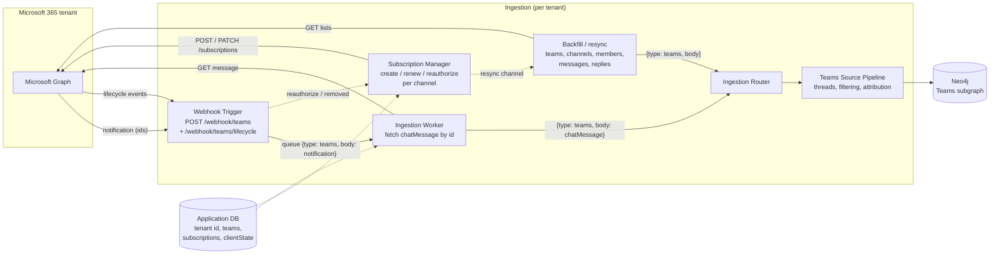

# Microsoft Teams ingestion: requirements and architecture

- Jira: EMBER-37 (drop-first), epic EMBER-19 (Teams Ingestion)
- Status: proposed, for team review. Documentation only. No code in this change.
- Microsoft Graph facts were checked against Microsoft Learn on 2026-09-29 (see [Sources](#sources)). Items marked **verify** could not be confirmed from Microsoft's documentation and should be checked in the build spike.
- Related: EMBER-36 Slack (shared patterns), EMBER-39 intake contract, EMBER-34 graph schema, EMBER-12 auth and multi-tenancy

EMBER-19 names the known risk: *"Graph API auth complexity is the known risk here, scope the auth work before the ingestion work."* That's why [Auth](#auth) is the longest section.

## Requirements and architecture

This section answers the three EMBER-37 acceptance criteria directly. Each answer links to the section with the details.

### 1. Requirements documented

- **Scope:** channel messages and replies in teams that install the Ember Teams app. 1:1 chats, group chats and meeting transcripts are out (see [Scope](#scope)).
- **Auth:** one Microsoft Entra app, packaged as a Teams app that uses **resource-specific consent (RSC)**.
  - Adding the app to a team grants read access to **that team only**. That's the Teams equivalent of inviting the Slack bot to a channel.
  - Ember uses app-only tokens, obtained with the client-credentials flow for each customer tenant.
  - No tenant-wide `ChannelMessage.Read.All`.
  - Details: [Auth](#auth).
- **Events:** Microsoft Graph change notifications, with one subscription per channel on `/teams/{team-id}/channels/{channel-id}/messages`.
  - Each subscription lasts at most **3 days** and must be renewed.
  - The app also has to handle lifecycle notifications.
  - Details: [Events and subscriptions](#events-and-subscriptions).
- **Data shapes:**
  - A change notification carries IDs only; Ember then fetches the message with a GET.
  - The message itself is a Graph `chatMessage`. `replyToId` links a reply to its thread, `channelIdentity` gives the team and channel, and `deletedDateTime` / `lastEditedDateTime` mark deletes and edits.
  - Details: [Data shapes](#data-shapes).
- **Limits:**
  - Ember's webhook must answer within **3 seconds**. Graph retries for up to 4 hours, then **drops notifications for good** if the endpoint stays slow.
  - Graph API calls are throttled with `429` and `Retry-After`.
  - The Teams APIs are **no longer billed** (since Aug 25, 2025).
  - Details: [Rate limits and delivery](#rate-limits-and-delivery).

### 2. Proposed architecture for Teams feeding ingestion

```
Microsoft Graph ──change notification──▶ Webhook Trigger  POST /webhook/teams
   (per-channel subscription)              check clientState, answer validationToken,
                                           ack within 3 s
                                                   │ notification (ids only)
                                                   ▼
Microsoft Graph ◀──GET message (app token)── Ingestion Worker: fetch raw chatMessage
                                                   │
Subscription Manager ──create / renew / reauthorize subscriptions per channel;
                       handle lifecycle events; trigger resync
                                                   │
Backfill / resync ──list channels, messages, replies, members──┘
                                                   ▼
                                  {"type":"teams","body":<raw Graph object>}
                                                   ▼
                     Ingestion Router ──▶ Teams Source Pipeline ──▶ Neo4j Teams subgraph
```

Teams needs one component Slack doesn't: a **subscription manager**. Slack keeps delivering events once the app is installed. Graph subscriptions expire after 3 days and can be removed at any time, so something must keep creating and renewing them for every channel. Details: [Architecture](#architecture).

### 3. Relationship to Slack (shared patterns)

| | Slack (EMBER-36) | Teams (this doc) |
| --- | --- | --- |
| Opt-in boundary | Invite the bot to a channel | Add the Teams app to a team (RSC) |
| Credentials | Bot token per workspace, signing secret | Entra app ID + secret or certificate. App-only token per tenant. `clientState` per subscription. |
| Live delivery | Slack pushes full events | Graph pushes IDs only; Ember fetches the message |
| Endpoint check | `url_verification` challenge (JSON) | `validationToken` echoed as `text/plain` within 10 s |
| Authenticity | HMAC signature + 5-minute window | Secret `clientState` in every notification (validation tokens only when resource data is included) |
| Keeping the feed alive | Nothing to do | Renew each subscription within 3 days and react to lifecycle events |
| Backfill | `conversations.history` + `replies` | List channel messages, with replies |
| Threads | `thread_ts` | `replyToId` |
| Edits and deletes | `message_changed` / `message_deleted` events | The same message is re-fetched with `lastEditedDateTime` / `deletedDateTime` |
| People | Slack user ID, joined by email | Entra object ID (`from.user.id`), joined by email or UPN |
| Intake | `{type:"slack", body}` | `{type:"teams", body}` |

Full comparison: [Relationship to Slack](#relationship-to-slack).

## Scope

**In:** standard channels' top-level messages and replies, the channel and team objects, and the team member list, for teams that installed the Ember app.

**Out, and why:**

- **1:1 and group chats.** These are Teams' direct messages, and the Slack design excludes DMs too. Reading them would need `Chat.Read.All` (tenant-wide) or per-chat consent.
- **Meeting transcripts and recordings.** The proposal's example answer ("decided in a Teams meeting") shows the value. But this adds more permissions (`ChannelMeetingTranscript.Read.Group` / `OnlineMeetingTranscript.Read.Chat`), has licensing caveats, and raises its own privacy questions. Recorded as a follow-up.
- **File contents.** Attachment metadata stays inside the message. Files live in SharePoint and would need separate permissions.
- **Private and shared channels:** to **verify**. RSC applies to "teams (and the channels within those teams)", but access to private and shared channels needs confirming in the spike.

## Auth

### Model: resource-specific consent (RSC), app-only

1. **One Microsoft Entra app registration** for Ember, with a client secret or certificate. Microsoft requires a **1:1 mapping** between the Teams app and the Entra app.
2. **One Teams app package** (manifest v1.12+). Its `webApplicationInfo.id` is set to the Entra app ID, and it declares these team-scoped application RSC permissions under `authorization.permissions.resourceSpecific`:

   | RSC permission | Why |
   | --- | --- |
   | `ChannelMessage.Read.Group` | Read the team's channel messages and replies. Also covers per-channel change notifications. |
   | `ChannelSettings.Read.Group` | List channels and their names and descriptions, to know what to subscribe to |
   | `TeamSettings.Read.Group` | Team name and settings, for the tenant and container records |
   | `TeamMember.Read.Group` | Team members, for attribution |

3. **Install equals consent.** A team owner adds the Ember app to a team, and the RSC permissions are granted **for that team only**. Removing the app removes access.
4. **Token:** Ember gets an **app-only token** for the customer's tenant with the client-credentials flow (`https://login.microsoftonline.com/{tenant-id}/oauth2/v2.0/token`, scope `https://graph.microsoft.com/.default`). One token per tenant, reused across that tenant's teams.
5. **Which teams granted access:** `GET /teams/{team-id}/permissionGrants` (beta) or the team's installed apps list. The `clientAppId` matches `webApplicationInfo.id`.

### Tenant controls and constraints (verified)

- **Tenant RSC setting.** Admins control team RSC with `Set-MgBetaTeamRscConfiguration`. The default, `ManagedByMicrosoft`, lets team owners consent. A tenant set to `DisabledForAllApps` blocks Ember entirely. Onboarding must detect this and say so clearly.
- **App upload.** A team owner can only install a custom app if the tenant allows custom-app upload, **and** either the Entra app is registered in the same tenant or the installer is a tenant admin.
  - **Self-hosted:** the customer registers its own Entra app and uploads its own Teams app. Everything is in one tenant.
  - **Hosted multi-tenant:** a customer tenant admin has to approve or publish the Ember app to their org catalog first. After that, team owners install it per team.
- **Accountability.** RSC calls are made as the app, not as a user. Ember must only read what it needs, and only in teams that installed it.

### Why not tenant-wide `ChannelMessage.Read.All`

- It reads **every** channel in the organization, which breaks the opt-in boundary we chose for Slack.
- It needs tenant admin consent.
- Microsoft treats application use of this permission as a **protected API**, which needs a separate access request reviewed by Microsoft.
- **Verify:** whether any protected-API request also applies to RSC `ChannelMessage.Read.Group`. Microsoft lists it as the least-privileged application permission for these APIs, and the protected-API note appears alongside `ChannelMessage.Read.All`.

### Secrets

- **Entra client secret or certificate:** per deployment, in the secret store. Never in git.
- **Per-subscription `clientState`:** a random value of up to 128 characters, stored with the subscription record.
- **Tenant ID, team IDs and subscription IDs:** in the Application Database integration settings (the proposal gives OAuth and connections to the CLI and web onboarding, EMBER-12).

## Events and subscriptions

**Resource:** `/teams/{team-id}/channels/{channel-id}/messages`, one subscription per channel. Change types: `created,updated`.

| Rule (verified) | Consequence for Ember |
| --- | --- |
| Maximum lifetime for `chatMessage` subscriptions: **4,320 minutes (3 days)** | Renew with `PATCH /subscriptions/{id}` well before expiry, for example every 2 days |
| A **`lifecycleNotificationUrl` is required** for Teams resources when the expiry is more than 1 hour away | Expose `/webhook/teams/lifecycle` (it can be the same endpoint) |
| `reauthorizationRequired` applies to all resources | Reply `202`, then `POST /subscriptions/{id}/reauthorize` or renew with `PATCH`. Don't send both within 10 minutes. |
| `subscriptionRemoved` applies to Teams `chatMessage` | Recreate the subscription, then **resync** that channel |
| `missed` is **not** sent for Teams `chatMessage` (Outlook only) | Graph won't say when notifications were dropped. A **periodic resync** is required. |
| Creating a duplicate subscription (same resource and change type) returns `409 Conflict` | Store subscription IDs and treat 409 as "already subscribed" |
| Endpoint validation: Graph POSTs `?validationToken=…`. Ember must reply `200`, `text/plain`, the decoded token, within **10 s**. | The same check applies to the lifecycle URL |
| `clientState` is echoed in every notification | Reject any notification whose `clientState` doesn't match the subscription |
| Latency for `chatMessage`: average under 10 s, maximum 1 minute | Close to real time |

**Without or with resource data.** Graph can include the message itself, encrypted, if the subscription supplies an encryption certificate (`includeResourceData: true`). **The first cut uses notifications without resource data.** That means:

- no certificate to manage
- the notification carries IDs and Ember fetches the message, which matches the team diagram's "workers fetch raw data only"
- the fetch always returns the message's current state

Resource data can be added later to save one GET per message.

**New channels:** a new channel needs its own subscription. The first cut finds new channels by listing a team's channels on each resync. A subscription to channel creation events might work too; **verify** whether RSC supports it.

## Data shapes

Every intake line is `{"type":"teams","body":<raw Microsoft Graph object>}`, unmodified.

| `body` is | Comes from | Identify by | Stable ID |
| --- | --- | --- | --- |
| Change notification collection `{value:[…]}` (see `packages/ingestion-envelope/fixtures/teams.json`) | Webhook | `value[].subscriptionId` and `resource` | `value[].resourceData.id` + `resource` |
| `chatMessage` | GET after a notification, or backfill | `@odata.type` / `messageType` and `channelIdentity` | `channelIdentity.teamId` + `channelIdentity.channelId` + `id` |
| `channel` | Backfill / resync | `membershipType`, `displayName` | `id` (`19:…@thread.tacv2`) |
| `team` | Backfill / resync | `displayName`, `visibility` | `id` (a GUID) |
| Team member (`aadUserConversationMember`) | Backfill / resync | `userId`, `roles` | `userId` (the Entra object ID) |

`chatMessage` fields the pipeline relies on (verified from Graph examples):

- `id`
- `replyToId`: `null` on a thread root; the root's ID on a reply
- `messageType`: `message` or `systemEventMessage`
- `createdDateTime`, `lastModifiedDateTime`, `lastEditedDateTime`, `deletedDateTime`
- `from.user.id` / `displayName` / `userIdentityType`
- `body.contentType` (`html` or `text`) and `body.content`
- `mentions`, `reactions`, `attachments`, `eventDetail` (system events), `webUrl`
- `channelIdentity.teamId` / `channelId`

Two differences from Slack that the pipeline must handle:

- **Bodies are usually HTML**, with `<at id="0">` mention tags that resolve through `mentions`.
- **A single message can arrive several times.** A notification and a later backfill can return the same message in different states (edited, deleted). The latest `lastModifiedDateTime` wins.

**Tenant:** every notification carries `tenantId`. A backfill run covers one tenant, and messages carry `channelIdentity`.

## Rate limits and delivery

**Inbound (Graph → Ember), verified:**

- A 2xx within **3 seconds** counts as delivered. Otherwise Graph retries with exponential backoff for up to **4 hours**. Retries allow 10 seconds.
- Microsoft recommends replying `202 Accepted` after queueing and doing the work later, which is exactly the receiver / worker split.
- **Throttling of slow endpoints:**
  - More than 10% of replies over 3 s in 10 minutes marks the endpoint **slow**, and notifications are delayed 10 minutes.
  - More than 15% over 10 s marks it **drop**, and notifications are **dropped and can't be recovered** for 10 minutes.

  This is why the receiver must never fetch the message inline.

**Outbound (Ember → Graph):**

- Graph throttles with `429` and a `Retry-After` header, and Teams limits are applied per app per tenant, among other scopes. Microsoft doesn't publish a specific number for listing channel messages. **Verify** under load, and honor `Retry-After` with a gate per tenant (same approach as the Slack backfill).
- Listing channel messages returns up to **50 messages per page** (default 20), and follows `@odata.nextLink`. Results are sorted by the last change to the whole reply chain. Replies come via `$expand=replies` (paged with `replies@odata.nextLink`) or the list-replies call.
- The request must be made in the tenant that owns the channel (per Microsoft's federation note).

**Cost:** the Teams APIs are **not metered** since Aug 25, 2025. The old payment models (`model=A` / `model=B`) are ignored.

## Architecture

Matches the team architecture diagram (section 2, "ingestion pipeline per tenant").



| Component | Does | Holds a token? |
| --- | --- | --- |
| Webhook Trigger | Answers `validationToken`, checks `clientState`, queues the notification, replies within 3 s | No, only the `clientState` values |
| Ingestion Worker | Takes a notification off the queue, GETs the message, emits it | Yes (per tenant) |
| Subscription Manager | For each installed team: lists channels, creates missing subscriptions, renews every ~2 days, handles `reauthorizationRequired` / `subscriptionRemoved` | Yes |
| Backfill / resync | Onboarding history, periodic resync (no `missed` events for Teams), after a subscription is removed, and for new channels | Yes |

**Public URLs:** Graph needs public HTTPS for both the notification and lifecycle endpoints, the same hosting need as the GitHub, Jira and Slack receivers. Microsoft also publishes the IP ranges Graph sends from, so the endpoint can be firewalled to them.

## Handoff to the pipeline

| Handoff point | Intake provides | Pipeline (EMBER-19) is responsible for |
| --- | --- | --- |
| Where data is handed over | `{type:"teams", body}` lines. Today that's stdout; later the router's queue (EMBER-2). | Routing `type: "teams"` to the Teams source pipeline |
| Identifying each object | Stable IDs: team `id`, channel `id`, message `teamId` + `channelId` + `id`, member `userId` | Recognizing each shape in [Data shapes](#data-shapes) |
| Duplicates and versions | The same message can arrive from a notification, a retry, and a resync | An idempotent upsert by message key. The newest `lastModifiedDateTime` wins. |
| Threads | `replyToId` on every reply | Rebuilding each thread (root + replies) as one record |
| Edits and deletes | The re-fetched message with `lastEditedDateTime` / `deletedDateTime` | Applying it to the stored message. A reversed decision supersedes the old one; it does not overwrite it. |
| People | `from.user.id` (the Entra object ID) and team members | Resolving to people and joining to GitHub and Jira by email or UPN. **Verify** that the member objects include email. |
| Noise | Nothing filtered: `systemEventMessage`, bot posts, reactions | Filtering and decision detection |
| Gaps | Resync runs; lifecycle events are logged | Treating resync output like any other intake |

## Relationship to Slack

**Reused from the Slack design (EMBER-36):**

- The intake contract, and "intake never filters".
- The receiver and backfill split: a thin, fast webhook that holds no token, and a separate raw-data fetcher. For Teams the fetcher also runs on every live notification.
- The opt-in boundary: nothing is read until a team explicitly adds Ember, and DMs and chats are excluded.
- A single token lookup, so tokens later come from the Application Database, keyed by the tenant (`team_id` for Slack, `tenantId` for Teams).
- Handoff by stable IDs, with thread reconstruction and attribution done by the pipeline.
- Rate-limit handling: a per-scope gate that honors `Retry-After`.

**What's new for Teams:**

1. **Subscription lifecycle management.** Slack has no equivalent. This is the largest piece of new work.
2. **Fetch after notify.** Without resource data every notification costs one GET. With resource data, Ember needs an encryption certificate and decryption.
3. **HTML message bodies** with mention tags, versus Slack's text and blocks.
4. **Two-step install:** the Entra app registration plus the Teams app package, possibly with tenant admin approval. Slack is one install from a manifest.
5. **No `missed` signal**, so a scheduled resync is needed.

## Risks

| Risk | Impact | Mitigation |
| --- | --- | --- |
| Customer tenant disables team RSC or custom-app upload | Ember can't be installed | Detect it during onboarding and show the admin the exact setting. Tenant-wide consent is a documented fallback, not the default. |
| Hosted install needs admin approval in each customer tenant | Slower adoption | Document the admin step and ship a ready-made app package |
| Subscriptions silently lapse (3-day lifetime, removals, no `missed`) | Gaps in the graph | Subscription manager with alerting, plus a periodic resync |
| Slow webhook responses trigger Graph's drop mode | Notifications lost for good | Acknowledge within 3 s, queue, and fetch asynchronously |
| Protected-API or private-channel limits turn out to apply to RSC | Scope shrinks | Verify first in the spike, before any build (per EMBER-19) |
| No Microsoft 365 test tenant on the team | Can't validate | Get a test tenant before the build ticket starts (open question) |

## Follow-ups (not changed in this PR)

| Where | Change | Owner |
| --- | --- | --- |
| `packages/ingestion-envelope/fixtures/teams.json` and `docs/contracts/ingestion-payload.md` | The fixture is a notification only. Consider a second Teams fixture holding a `chatMessage`, and a note that Teams intake includes fetched messages. | Ryan (EMBER-39 owner) |
| `services/pipeline/ontology/sources.py` (PR #9) | `_teams` only classifies notification collections. Fetched `chatMessage`, `channel`, `team` and member bodies return `None`. It needs rules matching [Data shapes](#data-shapes). | Brandon (EMBER-34) |
| `docs/graph-schema.md` (PR #9) | "Teams → Conversation: chat". Under this scope, the Teams Conversation is a **channel thread** (root + replies), and 1:1 and group chats are out of scope. | Brandon |
| Future build ticket under EMBER-19 | An auth spike first: register an Entra app, sideload into a test tenant, confirm RSC reads, a per-channel subscription, private channels, and the protected-API question | Payton |
| Meeting transcripts | A separate decision and ticket, if the team wants the "decided in a meeting" case | Team |

## Open questions

1. Does the team have, or can it get, a **Microsoft 365 test tenant** with Teams? (The developer-program sandbox is no longer freely available to everyone. **Verify** eligibility.)
2. Are **private and shared channels** in scope for launch, given they may need extra verification?
3. Should intake emit **both** the notification and the fetched message, or only the fetched `chatMessage`? This affects the contract fixture and Brandon's classifier.
4. **Meeting transcripts:** worth a separate ticket?
5. When a team **removes the Ember app**, keep or purge the data already ingested? This is the same question as open question 1 for Slack. Deciding once would cover both sources.

## Sources

Checked against Microsoft Learn on 2026-09-29:

- [Get change notifications for messages in Teams channels and chats](https://learn.microsoft.com/en-us/graph/teams-changenotifications-chatmessage): subscription resources, RSC `ChannelMessage.Read.Group` for per-channel subscriptions, the lifecycle URL rule, and payloads with and without resource data
- [Resource-specific consent for apps](https://learn.microsoft.com/en-us/microsoftteams/platform/graph-api/rsc/resource-specific-consent): team RSC permission names, and who can consent
- [Grant RSC permissions to an app](https://learn.microsoft.com/en-us/microsoftteams/platform/graph-api/rsc/grant-resource-specific-consent): manifest `webApplicationInfo` / `authorization`, the 1:1 Entra mapping, tenant RSC states, sideloading constraints, `permissionGrants`
- [subscription resource type](https://learn.microsoft.com/en-us/graph/api/resources/subscription): maximum lifetime (4,320 minutes for `chatMessage`), `lifecycleNotificationUrl`, `clientState`, latency
- [Receive change notifications through webhooks](https://learn.microsoft.com/en-us/graph/change-notifications-delivery-webhooks): the 3 s acknowledgement, 4 h retries, slow and drop throttling, `validationToken` (10 s, `text/plain`), `409` on duplicates
- [Lifecycle notifications](https://learn.microsoft.com/en-us/graph/change-notifications-lifecycle-events): `reauthorizationRequired`, `subscriptionRemoved`, and the fact that `missed` isn't sent for Teams messages
- [List channel messages](https://learn.microsoft.com/en-us/graph/api/channel-list-messages): permissions, 50 per page, reply expansion, sort order, the federation note
- [Get chatMessage](https://learn.microsoft.com/en-us/graph/api/chatmessage-get): message and reply GET, and the permissions for each
- [Metered APIs](https://learn.microsoft.com/en-us/graph/metered-api-list): Teams APIs not metered since Aug 25, 2025
- [Microsoft Graph throttling limits](https://learn.microsoft.com/en-us/graph/throttling-limits): Teams limits by scope. No specific published number for listing channel messages.
