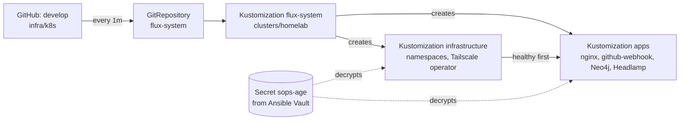

# Flux: GitOps for the homelab cluster

Since EMBER-57 (PR #22, merged 2026-10-06), Flux deploys everything in `infra/k8s` to the `homelab` cluster from the `develop` branch. **Merging to `develop` is the deploy.** Nobody runs `kubectl apply` or `helm` against the cluster by hand.

Ansible still owns what Flux cannot do: preparing the nodes, installing k3s, installing Flux once, handing Flux its decryption key, and the end-to-end health checks (`../docs/k3-setup.md`, `../ansible/`).

All commands below run from `infra/ansible` after `make deps`, which installs `flux`, `kubectl`, `helm`, `sops` and `age` into `.venv/bin`. Add `.venv/bin` to your `PATH` to use them directly.

---

## Why Flux

We chose Flux over Argo CD. The full decision is ADR 0003 (`docs/adr/0003-gitops-controller.md`).

| | Flux | Argo CD |
|---|---|---|
| Footprint | 4 small controllers | Server, repo-server, app controller, Redis, ApplicationSet, Dex, notifications |
| Repo fit | Adds `clusters/homelab/`; nothing else moved | Works, but values-file Helm apps need multi-source Applications |
| Secrets | SOPS decryption built in | Needs Sealed Secrets, External Secrets or a plugin |
| Helm | Real Helm releases; `helm history` works | Renders charts and applies the objects; no Helm release |
| Image updates | Built-in controllers | Argo CD Image Updater, a separate project |
| Web UI | None built in (we run Headlamp instead) | Built in; Argo's main advantage |

The workers have about 4 GB each, Neo4j takes 2 Gi of hv-worker-1, and pi-cp is tainted `CriticalAddonsOnly`, so footprint mattered.

Before Flux there were four deploy paths (`apps-up`, `neo4j-up`, `ts-operator-up`, and k3s auto-deploy), run by hand from one machine in a remembered order. Nothing removed what was deleted from Git, and nothing showed whether the cluster matched Git.

---

## How it is set up

```
infra/k8s/
  clusters/homelab/
    flux-system/
      gotk-components.yaml    # Flux controllers + CRDs (generated: make flux-components)
      gotk-sync.yaml          # GitRepository on develop + the flux-system Kustomization
      kustomization.yaml
    infrastructure.yaml       # Flux Kustomization -> infra/k8s/infrastructure
    apps.yaml                 # Flux Kustomization -> infra/k8s/apps, dependsOn infrastructure
  infrastructure/
    namespaces.yaml           # ember, tailscale, headlamp (prune: disabled)
    tailscale-operator/       # HelmRepository, HelmRelease, values.yaml, operator-oauth.sops.yaml
  apps/
    nginx/                    # reverse proxy behind the public Ingress
    github-webhook/           # placeholder listener (EMBER-56 replaces it)
    neo4j/                    # HelmRepository, HelmRelease, values.yaml, service-lb.yaml
    headlamp/                 # HelmRepository, HelmRelease, values.yaml, ingress.yaml, viewer.yaml
.sops.yaml                    # (repo root) which files SOPS encrypts, and to which age key
```



| Flux object | Path | What it does |
|---|---|---|
| GitRepository `flux-system` | `https://github.com/cbu-capstone-design-27/ember`, branch `develop` | Fetches only `infra/k8s` every minute. The repo is public, so no credentials |
| Kustomization `flux-system` | `infra/k8s/clusters/homelab` | Applies Flux itself and the two Kustomizations below. Flux upgrades itself from `gotk-components.yaml` |
| Kustomization `infrastructure` | `infra/k8s/infrastructure` | Namespaces and the Tailscale operator. `wait: true`: Ready only when everything it applied is healthy |
| Kustomization `apps` | `infra/k8s/apps` | Ember workloads. `dependsOn: infrastructure`, so the Tailscale operator exists before any Ingress |

Both `infrastructure` and `apps` **prune**: an object removed from Git is deleted from the cluster. That also cleans up the old hash-suffixed ConfigMaps that a config edit leaves behind. Namespaces are the exception. They carry `kustomize.toolkit.fluxcd.io/prune: disabled`, so dropping one from `namespaces.yaml` cannot take Neo4j's data with it.

What runs on the cluster:

| Namespace | Workload | How it is deployed |
|---|---|---|
| `flux-system` | source, kustomize, helm, notification controllers | `gotk-components.yaml` |
| `tailscale` | Tailscale operator + one proxy per Tailscale Ingress | HelmRelease, chart 1.102.4 |
| `ember` | nginx, github-webhook placeholder | Plain manifests |
| `ember` | Neo4j (pinned to hv-worker-1) | HelmRelease, chart 2026.9.0 |
| `headlamp` | Headlamp + Flux plugin | HelmRelease, chart 0.45.0 |

Public and tailnet addresses:

| URL | Reachable from | Serves |
|---|---|---|
| `https://ember.tail470a31.ts.net` | Internet (Funnel) | nginx, which routes `/webhook/github` and `/healthz` |
| `https://headlamp.tail470a31.ts.net` | Tailnet only | Headlamp |
| `bolt://hv-worker-1.tail470a31.ts.net:7687` | Tailnet only | Neo4j |

---

## Day to day

### Change something on the cluster

1. Edit the files under `infra/k8s` on a feature branch, as for any other change.
2. Optional: preview what it would change with `make apps-diff`, which compares your checkout with the cluster.
3. Optional: try it on the cluster before merging (next section).
4. Open the PR into `develop` and merge it. Flux applies it within about a minute. `make sync` applies it now.
5. Check: `make flux-health`, then the health target for what you changed (`apps-health`, `ts-operator-health`, `neo4j-health`).

If a change does not show up, `flux get kustomizations` tells you whether Flux has the new commit and whether applying it failed.

### Try a branch on the cluster before merging

```bash
git push origin <branch>
make flux-preview BRANCH=<branch>
# ... check it ...
make flux-preview-end        # after the PR merges, or to abandon the preview
```

`flux-preview` suspends the `flux-system` Kustomization, points the GitRepository at your branch, applies `clusters/homelab/*.yaml` from your checkout, and reconciles `infrastructure` and `apps`. The cluster is shared, so tell the team: everyone sees your branch until you end the preview.

`flux-preview-end` points Flux back at `develop` and resumes `flux-system`. Anything only your branch had is pruned. Run it **after** your PR merges. Ending a preview of a branch that is not merged rolls its changes back.

`make flux-health` says when a preview is in progress and which branch the cluster follows.

### See what is deployed

| Command | Shows |
|---|---|
| `make flux-health` | Controllers healthy, every Kustomization Ready, then `flux get all -A` |
| `flux get kustomizations` | Each Kustomization, the commit it applied (`develop@sha1:…`), and its last error |
| `flux get helmreleases -A` | Each Helm release, its chart version, and whether the last install or upgrade worked |
| `flux logs --level=error` | What the controllers rejected |
| Headlamp | The same in a browser (below) |

### Headlamp

`https://headlamp.tail470a31.ts.net`, on the tailnet only. It shows the whole cluster, with a Flux section from the Flux plugin.

Sign in with a token from `make headlamp-token`. It is valid for 24 hours and signs you in as ServiceAccount `headlamp-viewer`, which has the built-in `view` role. That role includes Flux's objects through Flux's `flux-view-flux-system` role. You can look at everything except Secrets, and change nothing. Use `make sync` or the `flux` CLI for actions.

The plugin comes from the image `ghcr.io/headlamp-k8s/headlamp-plugin-flux:v0.7.0`, pinned in `apps/headlamp/values.yaml`; an init container copies it into the pod. Headlamp's own ServiceAccount has no cluster role (the chart default would bind cluster-admin).

---

## Secrets with SOPS

Secrets live in Git only as SOPS-encrypted `*.sops.yaml` files. Flux decrypts them on the cluster. Today there is one: `infrastructure/tailscale-operator/operator-oauth.sops.yaml`, the Tailscale operator's OAuth client.

### How it works

There is one age key pair:

| Half | Where it lives | Who can use it |
|---|---|---|
| Public (`age1ktk6ux7…`) | `.sops.yaml` at the repo root, in Git | Anyone can **encrypt** |
| Private (`AGE-SECRET-KEY-…`) | Ansible Vault as `vault_sops_age_key`, and Secret `flux-system/sops-age` on the cluster | Only these can **decrypt** |

When you run `sops -e` on a file:

1. SOPS makes a random data key for that file.
2. It encrypts each value under `data:` and `stringData:` with that data key (AES-256-GCM). `encrypted_regex` in `.sops.yaml` picks those fields. Everything else stays readable: `kind`, `metadata.name`, the field names. That is why kustomize and CI can still read the file, and why a diff shows which field changed.
3. It encrypts the data key to the age public key and stores it in the `sops:` block at the bottom of the file.
4. It stores a MAC over all the values. If anyone edits the file without SOPS, decryption fails rather than using tampered data.

On the cluster, kustomize-controller sees the `sops:` block, unlocks the data key with `sops-age`, decrypts the values, and applies an ordinary Secret. The plain text exists only inside the cluster. k3s does not encrypt Secrets at rest unless it runs with `--secrets-encryption`.

CI (`sanity` job, step "k8s Secrets are SOPS-encrypted") fails on any `kind: Secret` that is not in a `*.sops.yaml` file, and on any `*.sops.yaml` without a `sops:` block.

### Add a secret

Encrypting needs only the public key, so anyone can do it. From the repo root:

1. Write the plain Secret to `infra/k8s/<dir>/<name>.sops.yaml`.
2. Encrypt it in place: `infra/ansible/.venv/bin/sops -e -i infra/k8s/<dir>/<name>.sops.yaml`
3. Check that the file now ends with a `sops:` block, then list it in `<dir>/kustomization.yaml`.
4. Commit. Never commit the plain version: Git history keeps it even after you fix the file.

### Edit a secret

Editing needs the private key:

```bash
cd infra/ansible
export SOPS_AGE_KEY="$(.venv/bin/ansible-vault view group_vars/all/vault.yml | sed -n 's/^  \(AGE-SECRET-KEY-.*\)/\1/p')"
.venv/bin/sops ../k8s/<dir>/<name>.sops.yaml     # opens decrypted, re-encrypts on save
unset SOPS_AGE_KEY
```

Never print the vault to your terminal or paste it anywhere: `ansible-vault view` shows every secret in it. A changed Tailscale credential only takes effect after `kubectl --context homelab -n tailscale rollout restart deploy/operator`.

### The key in the vault

`vault_sops_age_key` holds the whole `age-keygen` output as a block:

```yaml
vault_sops_age_key: |
  # created: <timestamp>
  # public key: age1...
  AGE-SECRET-KEY-1...
```

The `|` keeps it multi-line, and every line under it is indented exactly 2 spaces. Keep a copy outside the vault too, for example in a password manager. Without it nobody can decrypt or change the Secrets in Git.

### Rotate the key

1. Generate a new key: `umask 077; .venv/bin/age-keygen -o /tmp/age.key`
2. While the old key still works, put the new public key (`.venv/bin/age-keygen -y /tmp/age.key`) in `.sops.yaml`. Then run `sops updatekeys <file>` on every `*.sops.yaml` to re-wrap its data key.
3. Replace `vault_sops_age_key` in the vault with the contents of `/tmp/age.key` (`ansible-vault edit`), then delete `/tmp/age.key`.
4. Commit, then run `make flux-up` so the cluster gets the new private key in `sops-age`.

The key was rotated once already, on 2026-10-06, before anything had been encrypted with it, because the first key was exposed in a terminal session.

### Giving each person their own key (optional)

`.sops.yaml` can list several age recipients. Each teammate could have their own key, so editing secrets does not need the shared vault password. Removing someone means dropping their key and running `sops updatekeys`.

---

## Helm charts

Each chart is a Flux HelmRelease with its HelmRepository and its `values.yaml` beside it:

| Chart | Directory | Chart version | Notes |
|---|---|---|---|
| `tailscale/tailscale-operator` | `infrastructure/tailscale-operator/` | 1.102.4 | Installs and upgrades its CRDs (`crds: CreateReplace`). OAuth from `operator-oauth.sops.yaml` |
| `neo4j/neo4j` | `apps/neo4j/` | 2026.9.0 | Pinned to hv-worker-1 with a 10Gi `local-path-retain` volume; install and upgrade timeout 10m |
| `headlamp/headlamp` | `apps/headlamp/` | 0.45.0 | See Headlamp above |

How values reach the chart: each directory's `kustomization.yaml` turns `values.yaml` into a ConfigMap whose name ends in a hash of the file. `kustomizeconfig.yaml` lets kustomize rename the HelmRelease's `valuesFrom` to match. An edit to `values.yaml` therefore changes the HelmRelease, and Flux upgrades the release.

- **Change a value:** edit `values.yaml` and merge.
- **Upgrade a chart:** change `version` in `helmrelease.yaml` and merge. Check the chart's release notes first, since nothing else pins the result.
- **Look at a release:** `flux get helmreleases -A`, or `helm --kube-context homelab history <release> -n <namespace>`.

Wiping Neo4j's data: the volume outlives the release (`local-path-retain`). To start empty:

1. `flux suspend helmrelease neo4j -n ember`
2. `helm --kube-context homelab -n ember uninstall neo4j`
3. Delete PVC `data-neo4j-0`, its PV, and the PV's directory under `/var/lib/rancher/k3s/storage` on hv-worker-1.
4. `flux resume helmrelease neo4j -n ember` to install it fresh.

---

## Fresh cluster or disaster recovery

Everything on the cluster comes back from Git plus the age key in the vault.

1. Build the nodes and install k3s: `make up`, then `make kubeconfig` (`k3-setup.md`, Part 7).
2. `make deps`.
3. In the Tailscale admin console, remove any old `ember` and `headlamp` devices. Otherwise the new proxies come back as `ember-1` and `headlamp-1`, and GitHub's webhook URL stops working. The one-time tailnet setup (tags, `funnel` nodeAttr, OAuth client) is in `infra/k8s/README.md` under Tailscale operator.
4. `make flux-up`. It:
   - checks the cluster meets Flux's requirements (`flux check --pre`),
   - applies `gotk-components.yaml` and waits for the CRDs,
   - creates Secret `flux-system/sops-age` from `vault_sops_age_key` (server-side apply, so no plain copy is left in an annotation),
   - applies `gotk-sync.yaml`,
   - then waits up to 15 minutes for `infrastructure` and `apps` to be Ready.
5. Run `make apps-health`, `make ts-operator-health` and `make neo4j-health`.

---

## Make targets

| Target | What it does |
|---|---|
| `make flux-up` | First install, or after `make reset`: installs Flux and its age key, then health. Safe to re-run |
| `make flux-health` | Controllers healthy, every Kustomization Ready, lists what is deployed and which branch is followed |
| `make sync` | Fetch `develop` and apply it now instead of within the next minute |
| `make apps-diff` | What this checkout's `infrastructure/` and `apps/` would change on the cluster. Deploys nothing |
| `make flux-preview BRANCH=<branch>` | Deploy a pushed branch instead of `develop` |
| `make flux-preview-end` | Go back to `develop` |
| `make flux-components` | Regenerate `gotk-components.yaml` after changing `FLUX_VERSION` in the Makefile. Commit it; Flux upgrades itself |
| `make headlamp-token` | Print a 24-hour read-only Headlamp sign-in token |
| `make apps-health` | Public route end to end: Ingress hostname, nginx `/healthz`, a webhook POST from the tailnet and through Funnel, 404 on unknown paths |
| `make ts-operator-health` | Operator ready and logged in; each Tailscale Ingress has a hostname and answers HTTPS; each Funnel Ingress has public DNS |
| `make neo4j-health` | Pod ready on hv-worker-1; a query works in the pod and on every node's IP |

Removed with EMBER-57, because Flux does their job: `apps-up`, `apps-down`, `neo4j-prep`, `neo4j-up`, `neo4j-down`, `ts-operator-up`, `ts-operator-down`.

Tool versions are pinned in `infra/ansible/Makefile` and checksum-verified by `make deps`: Flux 2.9.6, SOPS 3.13.3, age 1.3.2, Helm 4.3.0, plus a kubectl that matches k3s.

---

## Troubleshooting

| Symptom | Check |
|---|---|
| A merged change is not on the cluster | `flux get kustomizations`. An old commit in REVISION means Flux has not fetched it yet: `make sync`. A newer commit with Ready `False` means applying failed; the MESSAGE column says why |
| `kustomization path not found` on `flux-system` | The cluster follows a branch without `infra/k8s/clusters/homelab`. Check the branch with `make flux-health`, and `make flux-preview-end` if a preview was left running |
| `decryption failed` or `sops` errors | Secret `flux-system/sops-age` is missing or holds a different key than `.sops.yaml` names. Re-run `make flux-up`; if that fails, compare the public key in `.sops.yaml` with the vault's key |
| A HelmRelease is not Ready | `flux get helmreleases -A`, then `kubectl --context homelab -n <ns> describe helmrelease <name>`. After a fix, `flux reconcile helmrelease <name> -n <ns> --with-source`. If it gave up retrying, `flux suspend helmrelease …` then `flux resume helmrelease …` |
| `apps` stays not Ready while `infrastructure` is fine | A workload in `apps` is not rolling out. `kubectl --context homelab get pods -A` and that pod's logs. A crash-looping new nginx pod means its config did not load; the old pod keeps serving |
| `make apps-health` fails on the hostname check | The Tailscale device came back as `ember-1`. Remove the stale `ember` device in the admin console, `kubectl --context homelab -n ember delete ingress ember`, then `make sync` |
| `ts-operator-health` fails on "Check the operator logged in" | The OAuth client lacks a scope or the `tag:k8s-operator` tag, or `operator-oauth.sops.yaml` holds an old credential (then restart the operator) |
| Headlamp shows no Flux section | `kubectl --context homelab -n headlamp logs deploy/headlamp -c flux-plugin`, the init container that copies the plugin |
| Headlamp says forbidden | Expected for Secrets and for any change: the viewer token is read-only. An expired token (24 hours) also lands here: run `make headlamp-token` again |
| CI fails "k8s Secrets are SOPS-encrypted" | A Secret outside a `*.sops.yaml` file, or a `*.sops.yaml` that was never encrypted. Encrypt it (Add a secret, above). If plain text was pushed, rotate that credential |

---

## What EMBER-57 delivered

| Commit | Change |
|---|---|
| ADR 0003 | Records the Flux decision and the Argo CD comparison |
| Sortable image tags | CI also tags images `<branch>-<run>-<sha>`, because `<branch>-<sha>` cannot be ordered and Flux image automation needs an order (`docs/container-images.md`) |
| SOPS | `.sops.yaml`; the age key in the vault; `flux`, `sops` and `age` pinned in `make deps`; the CI check for unencrypted Secrets |
| Flux | `clusters/homelab/`, `playbooks/flux.yml` and its make targets. `apps.yml` keeps only health checks; the `ember.io/generated` label workaround is gone |
| HelmReleases | Tailscale operator, Neo4j and Headlamp. Neo4j is no longer kept out of `apps/kustomization.yaml`. The Tailscale and Neo4j playbooks keep only health checks |
| Tailscale OAuth in SOPS | `operator-oauth.sops.yaml` replaces the Secret Ansible created from the vault |
| Docs | `infra/k8s/README.md`, `k3-setup.md`, root README |
| Preview-safe health | `flux-health` works during a preview and right after a first install |

How it was verified, on a cluster reset to bare k3s:

- `make flux-up`, then `make flux-preview` on the PR branch. Both Kustomizations went Ready, all three HelmReleases installed, and all pods ran on the workers.
- The public Ingress came back as `ember.tail470a31.ts.net`.
- `make apps-health` passed, including a POST through Funnel's public address. `ts-operator-health` and `neo4j-health` passed too.
- Headlamp listed the Flux plugin. The viewer token got 200 on namespaces and Flux Kustomizations, and 403 on reading Secrets and on deleting a pod.
- After the merge, `make flux-preview-end` moved the cluster to `develop@1d51b5af` with no changes to workloads, and all checks passed again.

### Open follow-ups

- [ ] EMBER-56: GHCR `imagePullSecret` (a `*.sops.yaml` Secret; the packages are private) and replacing the placeholder `github-webhook` with the real `github-ingestion` image
- [ ] Flux image automation: ImageRepository and ImagePolicy on the `<branch>-<run>-<sha>` tags. Decide whether it pushes to `develop` (needs a branch-protection bypass) or opens PRs from its own branch
- [ ] Move Neo4j's password from `apps/neo4j/values.yaml` into a SOPS Secret (`passwordFromSecret`), and update `neo4j-health`, which reads the password from `values.yaml`
- [ ] Remove the now-duplicate `vault_ts_oauth_client_id` and `vault_ts_oauth_client_secret` from the vault
- [ ] Back up the age key outside the vault
- [ ] Optional: turn on k3s `--secrets-encryption` so decrypted Secrets are encrypted at rest
- [ ] Optional: Flux notifications (commit status on GitHub, or a Slack message, when a deploy succeeds or fails)
